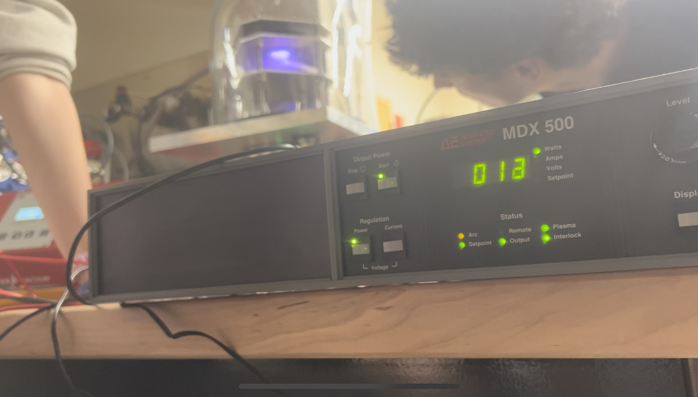

# Melinda Chen

### Update 0

#### Accomplishments

* Read through sputtering documentation and project primers
* Read through required textbook chapters and 'Filling in the Gaps' resources
* Met with project partner Katie to go through project goals and potential avenues forward
* Walked through state of current sputter chamber with team leads

#### Roadblocks

* No major blocks so far

#### Plans

* Literature review of current characterization techniques
* Meet with Katie to draft project proposal and timeline

### Update 1 (1/19-1/26)

#### Accomplishments

* Drafted project proposal and timeline
* Researched thin film characterization techniques
* Submitted requests for training on XRR (with Professor Sokalski) and AFM
* Compiled existing sputtering chamber setups from online sources into spreadsheet
* Performed sputtering trials using Aluminum target + practiced tuning pressure using Argon flow rate and vacuum strength to maintain stable plasma

#### Roadblocks

* Priority is figuring out why the sputtering current is so low + how to tune sputtering parameters to improve power

#### Plans

* Get trained on XRR next Thursday
* Continue literature review&#x20;
* Sputtering trials with Aluminum target --> Try sparking using high flow rate to create dense plasma then lowering pressure to increase amount of sputtered particles that reach the substrate

#### Responses

* From Jay
  *   For the progress update, be sure to link to the document(s) that show evidence of your progress. this week that would be a link to you project proposal

      For roadblocks, this is an opportunity to request help, or clarify what you need from us to keep moving forward. I would argue training on certain equipment to be roadblock for you.

      For plans, there should be more detail in how you're going to proceed, or link to your working doc that demonstrates your plans in more detail. For example, link what literature you plan to read first, this helps me guide your research. What do you want to learn form theses trials? why is it useful in working towards the end goal. For example you could discuss the methodology for DC al sputtering and how that informs the development of reactive DC AL2O3 sputtering. Being specific helps me evaluate if your plans for the week will actually end up being productive. Based on Fridays session, ik that you have more specific well justified plans, so be sure to articulate them here, or better yet, direct me to a document that articulates your plans.

### Update 2 (1/20-2/2)

#### Accomplishments

* Met with Professor Sokalski to discuss XRR&#x20;
* Assisted chamber modifications for RF sputtering
* RF Sputtering trial with Aluminum target
  * learned how to use RF sputtering equipment and fundamentals behind impedance matching
* Chamber bias literature review
* Completed AFM online training and reached out to MCF contact for in-person training

#### Roadblocks

* Main roadblock is still sputtering chamber not working - will continue to look into specific reasons why target seems completely unscathed after a few hours of being near plasma
* Some of the RF sputtering electronics are cooked

#### Plans

* AFM in-person training
* Continue sputtering chamber debugging - both literature review and in-person tests
* Ideally also XRR in-person training, depends on how fast MCF contact responds.

#### Responses

* make sure to link working notes, and updated project tracker
* Good job finalizing choice of XRR for characterization

### Update 3 (2/2-2/9)

#### Accomplishments

* Completed XRR training with Besty
* Completed AFM training
* Contacted Andrew to ask about correct AFM tips
* Helped perform sputtering tests on Thursday and Saturday to try to debug chamber

#### Roadblocks

* Sputtering chamber still not working - blocking capacitor seems like promising solution

#### Plans

* Perform sputtering test with Aluminum Oxide/Insulating material to test blocking capacitor theory
* Perform XRR on sample similar to expected sputtering chamber output
* Start writing SOPs + Drawing out schematic of characterization pipeline

#### Responses

* From Jay
  * Good job completing both AFM and XRR training, good job helping with sputter chamber debugging.
  * As discussed in person, RF sputtering test wont be fruitful until we implement a blocking capacitor. So I would prioritize XRR practice on oxide and evaporated Al samples.
  * Based on: [https://www.lesker.com/newweb/ped/rateuniformity.cfm](https://www.lesker.com/newweb/ped/rateuniformity.cfm) I worry that the oxide sputter test (hoping oxide acts a blocking cap itself) may not be a good use of time, since we may have to sputter for ridiculous amounts of time to see anything). Which is also another good reason to do Reactive Al Rf sputtering instead of Al2O3 target sputtering.
  * DC Al sputter tests may still be interesting this week.
  * Please make sure to links to working docs, and an updated github project tracker.

### Update 4 (2/9-2/16)

#### Accomplishments

* Created Aluminum thin layer samples using the thermal evaporation chamber
* Attempted XRR on samples
  * Seemed to be unsuccessful - potentially issues with surface roughness, or sample size.
* Helped perform sputtering tests on Thursday with the blocking capacitor to try to debug chamber
* Placed order for AFM tips - turns out Joel has some

#### Roadblocks

* Sputtering chamber still not working : (

#### Plans

* Perform XRR on thermally grown oxide -> hopefully better surface roughness and larger sample size will result in visible results
* Track down AFM tips and try to perform AFM on thermally evaporated Al samples to get rough idea of surface roughness
* Continue literature review/researching potential causes for sputtering chamber not working.

Updated Project Tracker: [https://github.com/orgs/hacker-fab/projects/36](https://github.com/orgs/hacker-fab/projects/36)

#### Responses - Jay

* Given the chamber roadblocks, I think continuing to workout XRR with thermal oxide and sanity checking the evaporated Al samples with AFM techniques makes sense.
* Rahim and I are working on upping the Vp-p of th rf supply in hopes that low Vp-p has been the issue. If this doesnt work, we will start doing reactive DC with V1 chamber.

### Update 5 (2/16-2/23)

#### Accomplishments

* Created presentation + video tutorial for XRR setup + SOP for XRR (linked in presentation slides and in drive: [https://drive.google.com/drive/folders/1C9F45\_9w07ARenv4gUgpu121mef5XScS](https://drive.google.com/drive/folders/1C9F45_9w07ARenv4gUgpu121mef5XScS)) to present to HackerFab class
* Performed XRR on thermally grown oxide (see image below)
  * Scan provided reasonable outputs with visible peaks&#x20;
  * Peaks were shallower than typical XRR data --> not crippling issue for thickness characterization but good thing to look into to see if we can improve the test setup

<figure><figcaption>
XRR Data from thermally grown oxide showing thickness of 47.3 nm
</figcaption></figure>

*   Cleaved thermally evaporated sample from a few weeks back and mounted in epoxy + polished for SEM and EDS

    * Goal was to identify if SEM was a viable alternative for characterizing thicknesses that are slightly too high for XRR
    * Was able to identify aluminum layer with EDS but extremely difficult to focus image&#x20;
    * Also very difficult to capture images due to extremely high amount of drift at the level of magnification
    * Ultimately, characterizing thicknesses less than a micron without serious drift using the undergrad lab SEM will be difficult, thicknesses above 5 microns should be reasonable though

    <figure><figcaption>
Cleaved chip set in epoxy and polished to 0.05 micron alumina 
</figcaption></figure>

    &#x20;

    <figure><figcaption>
EDS of top surface of cleaved sample showing aluminum layer thickness of around 1.5 microns (consistent with QCM readout)
</figcaption></figure>

#### Roadblocks

* Sputtering chamber still not working : (

#### Plans

* Continue literature review/researching potential causes for sputtering chamber not working.
* Performing AFM on thermally grown oxide to see if surface roughness is a contributing factor to shallow XRR peaks
* More detailed plan for CV testing now that both Katie and I have done the probing lab

Updated Project Tracker: [https://github.com/orgs/hacker-fab/projects/36](https://github.com/orgs/hacker-fab/projects/36)

#### Response - Jay

* lmk if u need help with the DC cheater plug issue.&#x20;
* Rahim and I have been working to setup an old donated sputtering RF power supply. We tried to use it in the past but the associated matching network was broken, so it couldn't strike any plasma. Now we are retrying it, buy using our 300W antenna tuner as the matching network. This should be ready sometime his week, ideally tn (Tuesday). The idea is that this power supply will have much higher Vp-p. This will help us determine if the chamber is the problem or the the low Vp-p on our radio power supply is the problem. Regardless, this may let you start doing RF process dev soon.
* SEM image is very intersting. unfortunate that the feaure sizes we care about are a bit outside teh benchtop SEM resolution. However, based on your results. The benchtop SEM may be useful for some of Marta's work, ty!

### Update 6 (2/23-3/1)

#### Accomplishments

*   Remade cheater plug + Re-attempted DC sputtering trials

    * Was able to get the power to 10W using high pressure (100 sccm, \~200 mtorr) but still no sputtering observed
    * Changing the chamber configuration (i.e. number of teflon layers + adding in a smaller radius teflon spacer next to the target to prevent shorting) drastically changed quality of plasma confinement

    <figure><figcaption>
DC Sputtering re-trial, Power above 0.1W was achieved, but no sputtering observed
</figcaption></figure>
* RF sputtering trial with power supply from the MCF
  * Power supply was able to provide reasonable forward voltage (although impedance matching was a bit difficult), however no sputtering was observed
  * Plasma confinement was poor in this trial as well, with the plasma mostly consolidated near the edge of the target.
*   Literature Review for CV testing/electrical properties

    * Found a couple of papers on CV testing setups for semiconductor oxides (linked in literature review spreadsheet)
    * Notably, Sarah Brown's Cornell thesis has some good background information on electrical properties as well as a very interesting setup they used for probing capacitance across a sample:

    <figure><figcaption>
Setup for testing across whole surface of capacitor 
</figcaption></figure>

    * Currently reading up on Mott-Schottky analysis theory to better understand if/how we can pull oxide properties out of it
* Performed AFM on thermally grown oxide with the goal of getting surface roughness and correlating that information to XRR results from last week
  * AFM is hard to do
  * Ended up getting an image but lots of artifacts - ran out of time so will have to go back and tune gains + amplitude setpoint to get a cleaner image

#### Roadblocks

* Sputtering chamber still not working : (

#### Plans

* RF sputtering trial using MCF's matching network
  * Should be able to read out DC bias with it attached which will at least give us some info on if the DC bias buildup is the issue
  * Basically:&#x20;
    * Good DC Bias readout + sputtering --> Our RF power setup has an issue
    * Good DC Bias readout + no sputtering --> Our sputtering geometry has an issue (MFP potentially too low)
    * No DC Bias readout --> (cry?) and check grounding/connectivity
* Re-do AFM, focusing on tuning gains to get clearer image
* Reach out to Matt to ask for samples of different reference thicknesses to run XRR on + practice analysis&#x20;
* Continue CV testing literature review, come up with plan to fabricate electrode array

Updated Project Tracker: [https://github.com/orgs/hacker-fab/projects/36](https://github.com/orgs/hacker-fab/projects/36)

### Update 7 (3/9-3/16)

#### Accomplishments

*   Attempted to set up RF power supply and matching network provided by MCF to run sputtering trials&#x20;

    * Configuration is modeled after this video showing the same model power supply: [https://www.youtube.com/watch?v=33CPbqC-K8U](https://www.youtube.com/watch?v=33CPbqC-K8U)
    * power --> RFX-600 --> ATX-600 --> matching network (large yellow box) --> output (verified by Matt)
    * RFX-600 turns on, but ATX-600 does not turn on&#x20;
      * Substituting in a different ATX unit did not appear to change anything
    * Manual doesn't have any obvious leads on causes (link: [https://www.nanofab.utah.edu/wp-content/uploads/2022/10/AdvancedEnergy-RFX600generator-manual.pdf](https://www.nanofab.utah.edu/wp-content/uploads/2022/10/AdvancedEnergy-RFX600generator-manual.pdf)), only that both displays are supposed to turn on at the same time&#x20;

    <figure><figcaption>
RF power supply setup with instruments from MCF
</figcaption></figure>
* Joined Chamber Build for a day to make parts for Sputter V2, worked on drill-pressing holes in a steel plate and sacriligeously cutting through a heat sink

<figure><figcaption>
heat sink, bandsaw-ed to fit on steel plate
</figcaption></figure>

<figure><figcaption>
steel plate with holes drilled
</figcaption></figure>

#### Roadblocks

* Sputtering chamber still not working : (
* Waiting on AFM tips (have been ordered) since the last batch was apparently all broken
* X-ray lab closed between March 17 - March 21

#### Plans

* Since XRR development and sputtering trials are both gated next week, main focus will be on getting practice with CV testing pipeline
* Fabricate chip using thermally grown oxide w/MOScap fabublox procedure
  * Ideally also run gauntlet of tests on chip if no roadblocks in fabrication
* Arrange meeting with Katie + mentors/instructors to discuss project direction since most process development tasks (figuring out sputtering chamber parameters, times, pressures etc... ) are gated by chamber development
* Continue to help out with available chamber build + power supply tasks

Updated Project Tracker: [https://github.com/orgs/hacker-fab/projects/36](https://github.com/orgs/hacker-fab/projects/36)

Response - Jay

* Recap of meeting 3/17
  * Next steps are to assess the viability of reactive Al evaporations, and/or cycles of Al evaporation followed by oxidation.
* Overall good job helping out with setting up rf supply and moving chamber build forward

### Update 8 (3/9-3/16)

#### Accomplishments

* Set up temporary goals w/Jay and Katie given that sputtering chamber is in an uncertain state
  * Looking into reactive aluminum evaporation/alternative ways to make an aluminum oxide layer that don't involve
    * Justification: Will allow us to proceed w/ironing out characterization methods and help set the groundwork for DC reactive sputtering by figuring out reasonable pressures/times
* Literature review of both reactive evaporative aluminum and plasma oxidation techniques
  * Major properties from papers are summarized in the sheet: [https://docs.google.com/spreadsheets/d/1TKB6aHW9vdk9iT3zZkKUyYFrIMQ4lUR3xLNAh300AFA/edit?gid=1637598523#gid=1637598523](https://docs.google.com/spreadsheets/d/1TKB6aHW9vdk9iT3zZkKUyYFrIMQ4lUR3xLNAh300AFA/edit?gid=1637598523#gid=1637598523) (Note: articles in rows 2-16 are ones that I looked into, remaining are Katie's)
* Main takeaways from literature review:
  * Potential options:
    * Aluminum evaporation + Annealing under O2 atmosphere (seems to work decently above 550C w/thicknesses up to 100 nm level). Main roadblock is finding a furnace to do the annealing in. MSE undergrad lab tube furnace is one option, machining caps for the quartz tube in Hackerfab is another (something similar to the caps here: [https://labandfurnace.com/shop/tube-furnace/tube-furnace-with-gas-supply-system/1200c-600mm-w-3-controllers/250ltg-3-wg-1200c-large-diameter-3-zone-tube-furnace-w-gas-supply-system/?srsltid=AfmBOoqQ2F13fPdY\_bw6yLFLEMHXYy91TSmOKCwj9mBtqLsdc7qCYZ71](https://labandfurnace.com/shop/tube-furnace/tube-furnace-with-gas-supply-system/1200c-600mm-w-3-controllers/250ltg-3-wg-1200c-large-diameter-3-zone-tube-furnace-w-gas-supply-system/?srsltid=AfmBOoqQ2F13fPdY_bw6yLFLEMHXYy91TSmOKCwj9mBtqLsdc7qCYZ71))
    * Plasma oxidation: Was difficult to find data on low-temperature oxidation of Aluminum. Out of the two closest papers, one opted to do "atmosphere-pressure plasma oxidation" with heating, while the other was performed in a Dielectric-Barrier-Discharge reactor. Seems like temperature is a much more important factor than pressure, anything below 550K (some sources say 550C, will need to hand-calc check which one it is) will max out at 1-2nm oxides.&#x20;
  * Two mechanisms of oxidation: Cabrera-Mott (initial oxidation) --> Wagner (only relevant for high temp, slow growth after initial oxidation)
  * Potential strategy I think might work not mentioned in papers: Cycles of evaporation + oxygen flowing in&#x20;
    * Since the worry with flowing O2 into the evaporator is that the temp required to evaporate Al at higher pressures is not reachable, we can maybe cycle Al evaporation --> O2 flow (still at elevated temp?) --> pump back down to low pressure --> Al evaporation

<figure><figcaption>
Literature review conducted on Reactive Alumina growth options
</figcaption></figure>

* Attempted to figure out how low the vacuum can pump w/oxygen flowing in
  * MFC seems to be broken unfortunately

Roadblocks

* Sputtering chamber still not working : (
* Waiting on AFM tips (have been ordered) since the last batch was apparently all broken
* X-ray lab closed between March 17 - March 21
* MFC potentially broken

#### Plans

* Evaporate Al chip on Polysilicon, run through the plasma etcher at highest possible O2 pressure (based on literature, 0.5 torr should be enough to see something)
  * Not a lot of hope for this if the temperature is not sufficiently high
* If MFC gets fixed, try the Al evaporation --> O2 flow cycle mentioned above
* Continue lit review on reactive Al
  * Also contact Jason to talk about potentially just annealing in tube furnace
* Continue to help out with available chamber build + power supply tasks

Updated Project Tracker: [https://github.com/orgs/hacker-fab/projects/36](https://github.com/orgs/hacker-fab/projects/36)

### Update 10 (3/30 - 4/6)

#### Accomplishments

* Completed fabricating capacitor test sample using reactive aluminum evaporation strategy. Process is as follows:
  * Deposited aluminum pads on 2 samples, masked off half the samples with polyamide tape
  * deposited (potential) oxide on both samples as well as extra sample for XRR thickness characterization
  * removed XRR sample
  * deposited top aluminum electrode on the un-masked portion

<figure><figcaption>
Setup for capacitor fabrication w/reactive evaporation. Large chip on the bottom is for XRR
</figcaption></figure>

<figure><figcaption>
Capacitor samples with top electrode
</figcaption></figure>

* Performed XRR on evaporated sample, "oxide" was 16 nm thick and had noticeable density shift compared to the thermally grown silicon oxide sample

<figure><figcaption>
XRR critical angle comparison between silicon oxide and evaporated aluminum oxide
</figcaption></figure>

Roadblocks

* NOT THE SPUTTERING CHAMBER WOOHOO
* QCM unreliability with unknown material

#### Plans

* Full send on sputtering trials now that the chamber is working
  * Thickness characterization
  * Power characterization
  * XRR + AFM
  * Capacitor using evaporation chamber masking technique

Updated Project Tracker: [https://github.com/orgs/hacker-fab/projects/36](https://github.com/orgs/hacker-fab/projects/36)
