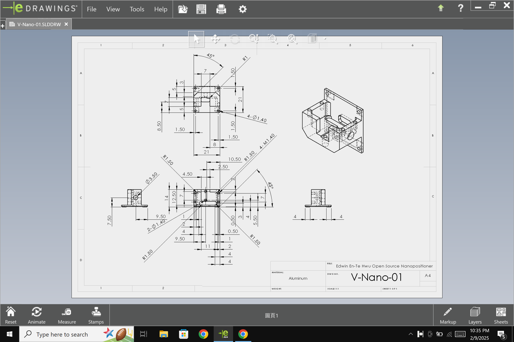
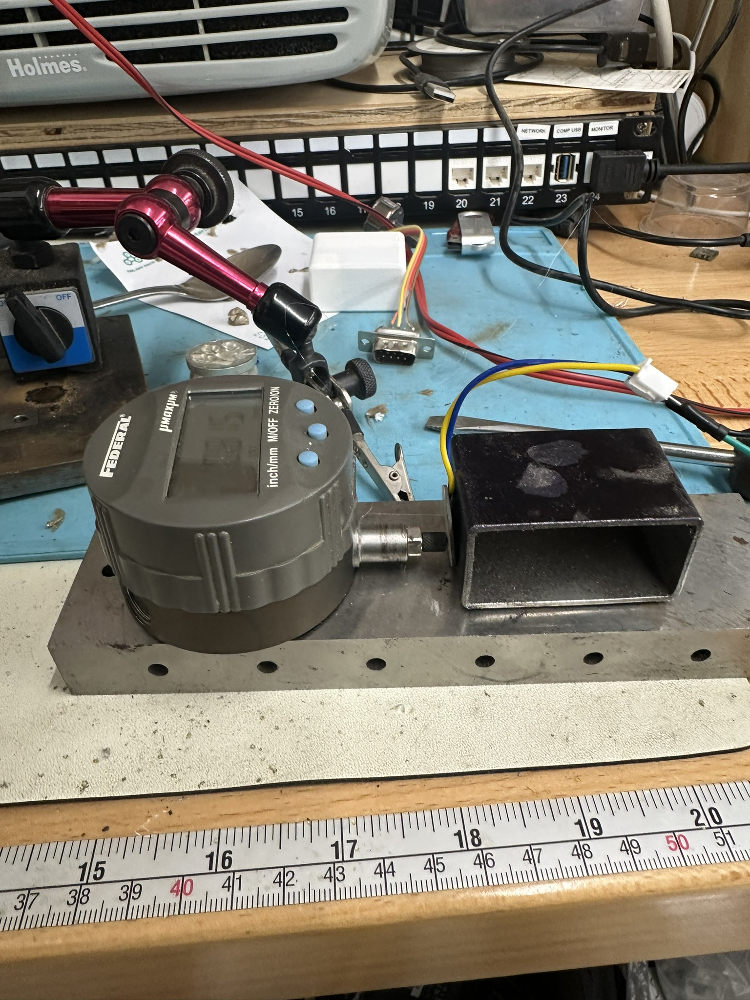
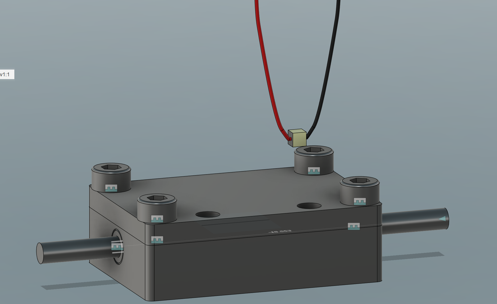
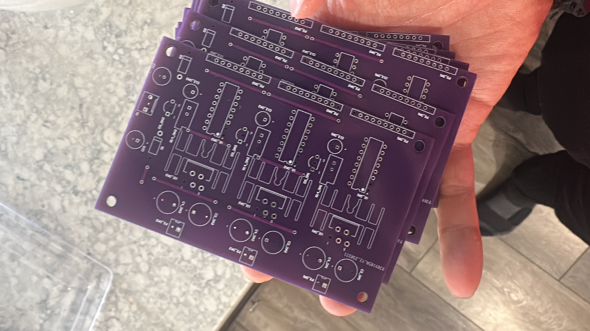
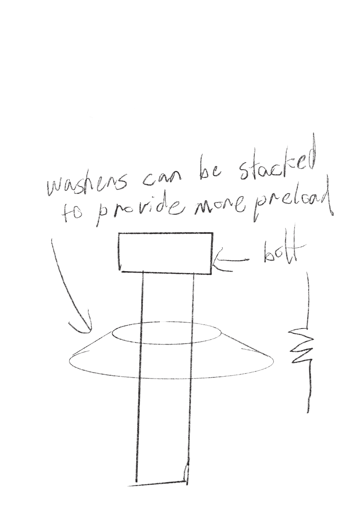
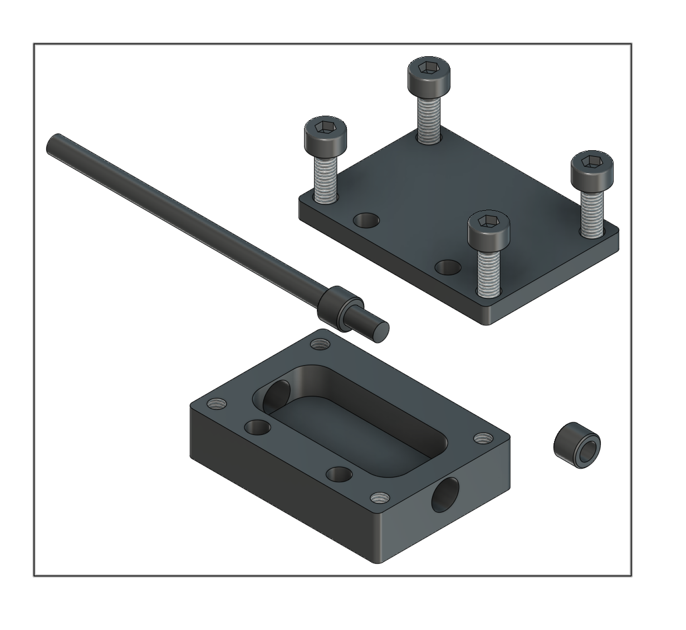
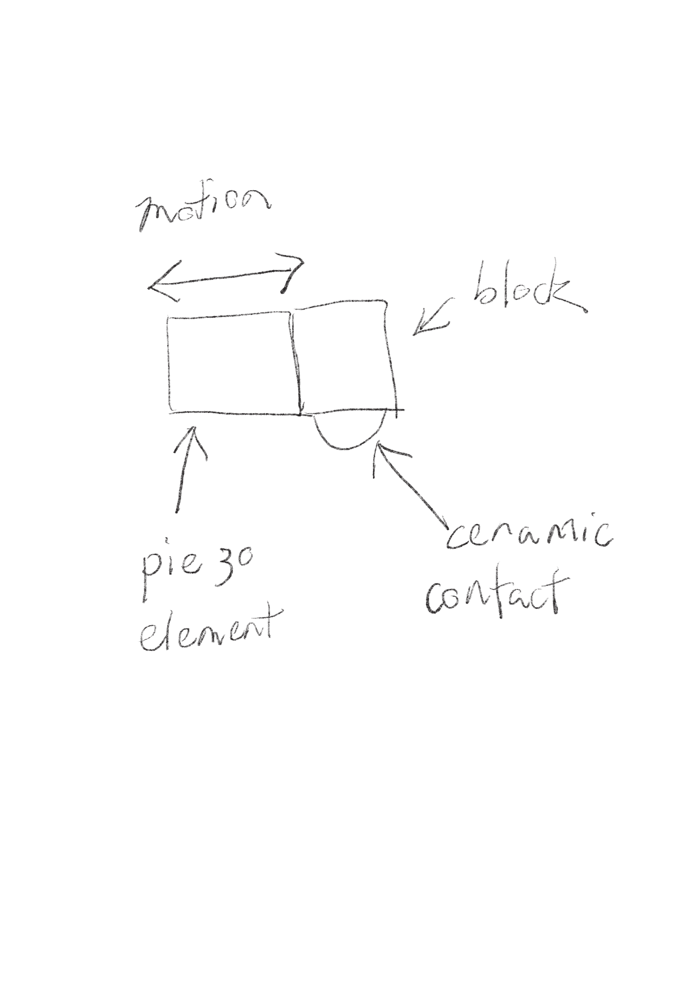
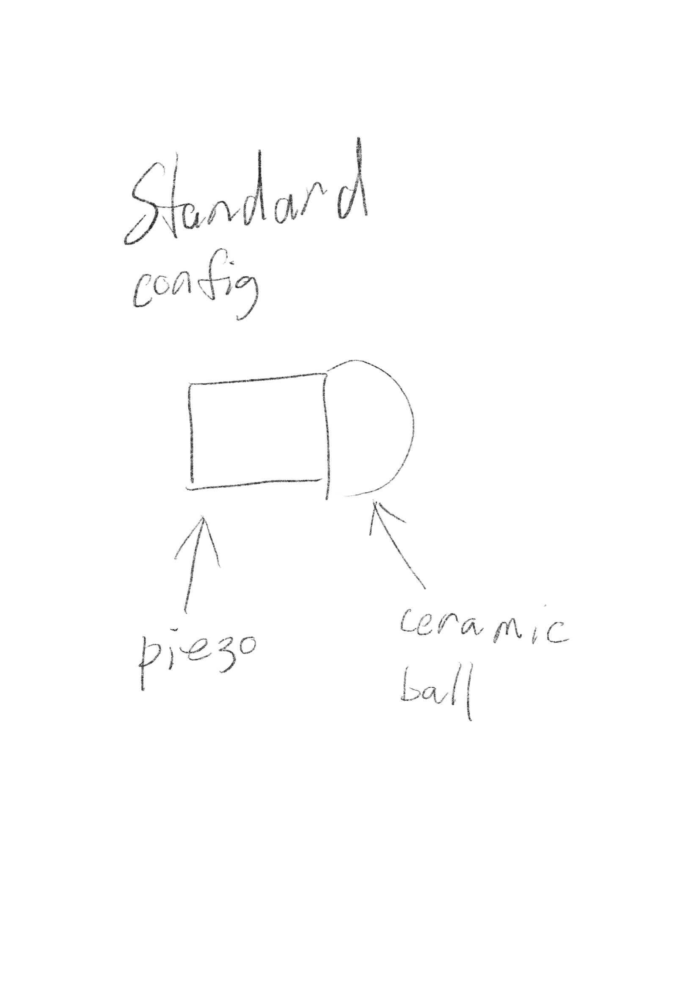

# Michael Juan

## **Update 0**

Focus for this week is to create a plan to quantify the errors in the current litho stepper. Work on my tormach 440 cnc machine to have "in house" machining capability.&#x20;

Preliminary Readings: ISO 230 Geometric accuracy of machines operating under no-load or quasi-static conditions, Foundations of Mechanical Accuracy, Precision Machine Design.&#x20;

### Next Steps

Create a project proposal


***

## **Update 1 (1/26/2025)**

### Accomplishments

* Created project proposal, received input from litho-stepper team and edited the proposal by added target values for mechanical accuracy of proposed nano-positioner.
* Welded a steel coolant tank using TIG (tungsten inert gas) welding. Leak tested the coolant tank by filling it with water and waiting to see if the tank leaked. There were several pinhole leaks.

<figure><figcaption><p>Cutting panels</p></figcaption></figure>

<figure><figcaption><p>long seam weld</p></figcaption></figure>

* Looked at the cad files for this open source piezo nano-positioner. [https://www.sciencedirect.com/science/article/pii/S2468067222000621](https://www.sciencedirect.com/science/article/pii/S2468067222000621)
* Created spreadsheet of potential tooling required for CNC milling nano-positioner parts.
* Started on creating the documentation for measuring the mechanical accuracy of Stepper V2.&#x20;

### Roadblocks

**Problem 1**

Coolant tank was not watertight. suspected cause was contamination from inadequate surface prep as well as skill issues with TIG (tungsten inert gas) welding. An attempt was made to braze the locations of leaks but a second leak test was not attempted due to time.

**Proposed Solutions**

* Grind out areas that have leaks, weld the leak locations again.
* Buy a coolant tank.

**Problem 2**

Did not finish documentation on test cases due to time overrun with coolant tank task.

**Proposed Solution**

Carry over task to the next week.

**Problem 3**

Unsure about who reviews my gitbook updates as well as github project tracker usage.

**Proposed Solution**

Ask at the next meeting.

### Next Steps

**Measurement:**

* Measure the mechanical accuracy of Stepper V2.

**Machining:**

* Order tooling.
* Order material.
* Tram the head of the CNC machine.
* PI tune CNC machine spindle motor.

**Nano Positioner:**

* Create a plan for machining mechanical parts of the nanopositioner.
* Work on CAM (computer aided manufacturing) for one loose tolerance part.

**Carry Over Tasks:**

* Create and document plan to measure the mechanical accuracy&#x20;


***


**Update 2 (2/2/2025)**\


### Accomplishments

**It is important to note that I am following axis orientation of the Stepper GUI, which is not consistent with industry norms.**&#x20;

_Link to testing results spreadsheet:_ [_https://docs.google.com/spreadsheets/d/1kp33Uu0bnELoj7gj8I\_tnA5ZHgbyOgtRBmU556TN2yw/edit?gid=457045106#gid=457045106_](https://docs.google.com/spreadsheets/d/1kp33Uu0bnELoj7gj8I_tnA5ZHgbyOgtRBmU556TN2yw/edit?gid=457045106#gid=457045106)

_Link to test procedure document:_

[_https://docs.google.com/document/d/1GBycb5NIzfImCTrVROQhtj5\_gETUNBXJAFKQSsnJRk8/edit?usp=sharing_](https://docs.google.com/document/d/1GBycb5NIzfImCTrVROQhtj5_gETUNBXJAFKQSsnJRk8/edit?usp=sharing)

*   Created a SOP for checking the parallelism  of wafers. &#x20;

    * The highest point and the lowest point were 7 microns apart. This could be due to residue from the cleaving the wafer, manufacturing tolerances, or small amounts of contamination that was not cleaned off through washing with acetone and isopropanol.
    * Did an informal test on contamination. Sharpie marks are around 2.5 micrometers, and finger smudges are measurable under 0.5 micrometer.


<div data-full-width="true"><figure><figcaption></figcaption></figure></div>

* Tested the backlash on the x and y axis of stepper at 10 positions each.&#x20;
  * The fixes for the X and Y axis by Carson resulted in less that 10 micron backlash.&#x20;
  * The backlash on the Z axis was so bad that it over-traveled my indicator. (will test it after a proposed fix)
* Tested the step accuracy of the stepper in 10 micron, 5 micron, 2.5 micron, and 1 micron increments.&#x20;
  * Steps were consistently inconsistent. (see linked spreadsheet)
  * &#x20;At smaller steps such as 1 micron there would often be no movement even after a command.&#x20;
* Did initial testing on squareness of axes. Initial testing with a 2 micron indicator and a granite square suggests that x and y axis squareness is not a issue.


<figure><figcaption></figcaption></figure>

* Did initial testing of how parallel the vacuum held wafer was to the axes.
  * I did not bring my course indicators because I assumed the error would be in the micron range. The error was higher than what my  indicators could measure.
  * Initial testing suggests that the vacuum is bending the wafer.
*

    <figure><figcaption></figcaption></figure>
* Performed manual PI tuning for CNC machine spindle motor.

### Roadblocks

**Problem 1**

**Did not get to test positional repeatability of axes. repeatability of limit inductive sensors, and hysteresis of limit sensors.**&#x20;

**Proposed Solutions**

Perform test on Tuseday 02/04/2025

**Problem 2**

Testing by manually typing g-code is slow. Even though most of the time spent was manually adusting the dial indicator there is speedups fr

**Proposed Solutions**

Create a gcode script if testing is going to be an ongoing thing.

### Next Steps

**Measurement:**

* Test the positional repeatability of axes, limit inductive sensors, and hysteresis of limit sensors.
* Converts notes from testing to repeatable SOPs.
* Test longer travel distance accuracy of axes.

**Machining:**

* Order tooling. (carry over)
* Order material. (carry over)
* Tram the head of the CNC machine. (carry over)


**Nano Positioner:**

* Work on CAM for the top plate of open source nanopositioner. Because there are no tolerances in the paper create a dimensioned drawing with best guess tolerances.
* Work on creating a simpler way of testing piezo nano positioning. (Sanity check)


### Final Notes/takeaways.

Inaccuracies of small steps (<10 micron) seems to be from motors lacking torque to micro step. friction/binding in the system.

Mechanical accuracy of z axis is so bad that its functionally unusable. (a fix has been proposed and is currently being implemented by Carson )&#x20;

The axis orientation of the stepper do not follow industry norms. This should be updated to prevent confusion.

even though the surface of the wafer is almost atomically flat. the bottom and top layer are not necessarily parallel.

The 3d vacuum wafer holder is tilted significantly.


***

&#x20;


**Update 3 (2/9/2025)**\


### Accomplishments

_**I**mportant Notes_

_The stepper components and axis orientation were changed between the last measurement and the tests performed on 2/8/2025._


* Worked on documentation on test procedures for measuring stepper.
* finished positional repeatability measurements of x and y axis.
* finished repeatability testing of homing switches.
*   Attempted CAM (Computer Aided Manufacturing) on open source piezo nano-positioner.

    * There were some DFM (Design for manufacturing) issues that makes the design unnecessarily complicated. &#x20;


* Worked on a modified design for a single axis nanopositioner, (modified from [https://www.sciencedirect.com/science/article/pii/S2468067222000621](https://www.sciencedirect.com/science/article/pii/S2468067222000621)).
*

    <figure><figcaption></figcaption></figure>
* read papers on friction drive nanopositioning.
* 3d printed the stl of nanopositioner. (printing it feb 10 morning)

### Roadblocks

**Problem 1**

Did not order some tooling and material for nanopositioner.&#x20;

**Proposed Solutions**

add items to purchase sheet before tuesday.

**Problem 2**

The  parts specified on nanopositioner have micron level tolerances. Therefore the nano positioner when stacked on top of each other might not be anywhere close volumetrically to nanometer accuracy.

**Proposed Solutions**

talk to team about it. Should not be a big problem.

**Problem 3**

Have big due date for major courses. Have to set up things on thursday for design school career fair.

**Proposed Solution**

Let leads know on tuesday meeting.

### Next Steps

**Measurements:**

* Check with team on proposed positional accuracy of redesigned nano-positioner.
* Check with team on proposed redesign of piezo nano-positioner.&#x20;

**Machining:**

* Add spotting drill, drills, taps, chamfer mills,ball endmill, roughing endmill, and collets to purchase sheet.


**Nano Positioner:**

* Add pre-ground aluminum bar to purchase sheet
* Machine bottom plate part when end mills arrive.
  * Will be a lot of work.&#x20;
  * Probably going to use sacrificial workholding instead of making custom workholding.
*   Add mechanical and electrical part for nanopositioner to purchase sheet.&#x20;

    * screws
    * linear slide (replace nippon bearing with thk because of availability)
    * connectors and wires
    * ICs

    ## **Update 4 (2/16/2025)**

### Accomplishments

* Worked on CAD for redesigned nano-positioner
* Worked on test procedures for positional accuracy.
* ran test cuts on scrap aluminum


<figure><figcaption></figcaption></figure>

### Roadblocks

**Problem 1**

Tooling for machining did not arrive.

**Proposed Solutions**

Machine the week of feb 17

**Problem 2**

Did not complete CAD for nanopositioner to a suitable state to machine.

**Proposed Solutions**

Work on cad before presentation date.

**Problem 3**

NanoPositioner linear rail out of stock

**Proposed Solutions**

Design around an alternative THK bearing slide.&#x20;

### Next Steps

**General**

Prepare presentation.

**Measurements**\
Finish up documentation for positional repeatability, step accuracy. and backlash measurement testing.

Bought an LVDT probe that "should" be able to measure double digit nanometers across very short distances. If time allows will redo some measurements.&#x20;

NanoPositioner

should be able to make all the parts for one axis of nanopositioner **IF** tooling arrives.&#x20;


**Update 5 (2/23/2025)**\


### Accomplishments

micron motion on piezo actuator!!!

<figure><figcaption><p>hot glued lvdt probe to block of metal, sandwiched piezo with another piece of metal.</p></figcaption></figure>

Used a function generator to output a 12v square wave to piezo.&#x20;




### Roadblocks

**Problem 1:**

Did not get anything else done other than measuring motion with piezo element.

**Solution:**

**revaluate timeline.**

**Problem 2:**

Got scammed by ebay seller. The lvdt was not the high precision version.&#x20;

**Solution:**

Buy another lvdt probe off of ebay.


### Next Steps

Try to measure movement accuracy of previous years piezo actuator.

NanoPositioner

if pcbs arrive start assembly.

## **Update 6 (3/6/2025)**&#x20;

### Accomplishments



<figure><figcaption></figcaption></figure>

* Started soldering circuitboards for piezo driver.

<figure><figcaption></figcaption></figure>

*   Worked on a design for a single axis piezo actuator. Below are some design considerations and criteria.

    * Design has to be easily machinable.
    * uses bellville washers for preload (simple to adjust when compared to coil springs)
    * for tight tolerance portions uses premade bushings loctited into bearing block.
    * &#x20;tries to minimize multiple machining operations.
    * reduce/eliminate the number of machined flexures.
    * Let precision be dictated by the stage side. Basically have the actuator be accurate and precise only constrained to one axis and let whatever stage its actuating against dictate the precision of the rest of the axes.
    *

        <figure><figcaption><p>belleville washer</p></figcaption></figure>

    <figure><figcaption></figcaption></figure>

### Roadblocks

**Problem 1:**&#x20;

Mcmaster Carr materials did not arrive

**Proposed Solutions**

Reorder.

**Problem 2:**&#x20;

Don't know if its possible to have piezo element with friction element in this configuration.


<figure><figcaption></figcaption></figure>

This puts a shear load on the glue interface between the piezo and the friction element. &#x20;

<figure><figcaption></figcaption></figure>

In a standard configuration there is no shear load on the glue joint between the ceramic friction element and the piezo.&#x20;

### Next Step

* Reorder mcmaster material.
* Order mcmaster materials personally.
* Solder surface mount components on piezo driver pcb.
* work on a design with a square actuator shaft rather than the cylindrical one in the above design.
  * There might be tigher machining tolerance requirements
  * might be easier to attach actuator to stage.
* Work on consolidating information for measurements into one spreadsheet. Currently its spread across multiple spreadsheets.
* Prepare mid semester documentation.


## **Update 7 (3/16/2025)**&#x20;

### Accomplishments

*   100 nm back and forth motion

    * 85v output from piezo driver  (pdu 150) correlated with \~100nm of motion.

    [https://youtube.com/shorts/gdKaye5rmxI?feature=share](https://youtube.com/shorts/gdKaye5rmxI?feature=share)
* 2 micron back and forth motion
  * 7 volt input and 150 output resulted in 2 micron motion.
* followed test procedures from pdu 150 datasheet. [https://www.piezodrive.com/wp-content/uploads/2023/08/PDu150-V6-Datasheet-R1.pdf](https://www.piezodrive.com/wp-content/uploads/2023/08/PDu150-V6-Datasheet-R1.pdf)

<figure><figcaption></figcaption></figure>

### Roadblocks

Roadblock 1:

Trying to output a sawtooth wave through pwm did not result in translational motion. I'm not sure if this is due the piezo needing a higher duty cycle pwm signal than what an arduino can provide or some mechanical issue.

Potential Solution:

Get an arduino that has a dac.

Roadblock 2:

not a big roadblock but measurement resolution might be an issue going forward since we know that the piezo can move sub 100nm.&#x20;

### Next Step

* Order an arduino that has a built in DAC.
* Try to test out my theory that inconsistent motion that people have seen when trying to replicate [this pape](https://www.sciencedirect.com/science/article/pii/S2468067222000621)r is due to a magnet based preload.

<figure><figcaption></figcaption></figure>

* As a simple first step I could swap out the magnet in the system with a weight to provide more preload. This could validate my spring based preload design without actually machining parts.
* A second step would be replacing contact point with a ball bearing. These can be prototyped before thorlab parts arrive.
* Salvage piezo actuators off of previous years nanopositioner.&#x20;

## **Update 8 (3/23/2025)**&#x20;

### Accomplishments




* semi controlled translation movement.
* Motion was achieved through a 10khz 5v sawtooth wave.

````c
#include "analogWave.h" // Include the library for analog waveform generation

analogWave wave(DAC);   // Create an instance of the analogWave class, using the DAC pin

int freq = 10000;  // in hertz, change 
int stepTime = 1000; // in milliseconds

void setup() {
  Serial.begin(115200);  // Initialize serial communication at a baud rate of 115200
  wave.saw(freq);       // Generate a sawtooth wave with the initial frequency
}

void loop() {
  wave.freq(freq);  // Set the frequency of the waveform generator to the updated value
  delay(stepTime);      // Delay for steptime
  wave.freq(0);
  delay(5000); //stop for five seconds
}
```
````

* The load capacity of this stick slip mechanism was almost nonexistent. This is an issue because we have a stacked stage configuration where one stage is above another.
* Swept through frequency to see if motion behaved linearly to frequency. Taking a slow motion video and counting frames seems to suggest that 10khz is twice as fast as 5khz.
* Attempted to measure step accuracy. I was not able to use my dial indicators to check for accuracy because the spring loading on the measurement tools were too strong for the force of the actuation.

### Roadblocks

**Roadblock 1:**

Did not get quantitative information on distance traveled per step.

**Proposed Solution**

Use a calibration slide on a microscope to measure travel distance.

**Roadblock 2:**

Thorlabs ceramic contact points and piezos have not arrive yet. I've tried to salvage existing piezos but the superglue mounting sometimes breaks the piezo.

**Proposed Solution**

* Try to get at least one working salvaged piezo.
* Temporarily use a ball bearing instead of the ceramic contact points from Thorlabs.

**Roadblock 3:**

Adding more preload to the current flat contact point actuator just binds up the system.

**Proposed Solution**

When ball contact points are made or when thorlab parts arrive check to see the optimal amount of preload.&#x20;

### Next Steps

We have three things we have to test  and do for the upcoming week to have progress for presentation 2.

1. test having a ball contact instead of the current surface contact&#x20;
2. Test how much preload results in a usable load rating and consistent actuation.&#x20;
   1. Using a scale and weights incrementally increase until we see a usable actuation force. Usable right now should be able to overcome the spring force on my measurement tools. A reasonable target to hit might be 750g on each axis.
3. Test the effects of sawtooth wave frequency, amplitude and a combination of both on actuation with updated prototype.
   1. Start off at 10khz and actuate for 500ms then measure distance.&#x20;
   2. Decrement the frequency by 500ms and actuate and measure distance.
   3. repeat until there is no measurable movement.
   4. For measuring the effects of amplitude on motion. Set a frequency such as 5khz, and a actuation time of 500ms. Start off at 5v and decrement voltage by 0.1v and measure distance.
   5. repeat until there is no measureable movement.

Because shipping is outside of my control. these are things I can work on while thorlabs parts are in the mail. I think right now my time won't be best spent on doing CAD because there are a lot of variables we don't know yet that will end up influencing the mechanical design.

* Write code to interface piezo actuator with our motion controller.&#x20;
  * We use grbl for our motion controller. As far as I know grbl can only output step and direction.&#x20;
  * The first step   would be to find a good ratio to map the step signals from the controller to a frequency of sawtooth waves.
* Test the effects of sawtooth wave frequency, amplitude and a combination of both on actuation for the existing prototype. \


