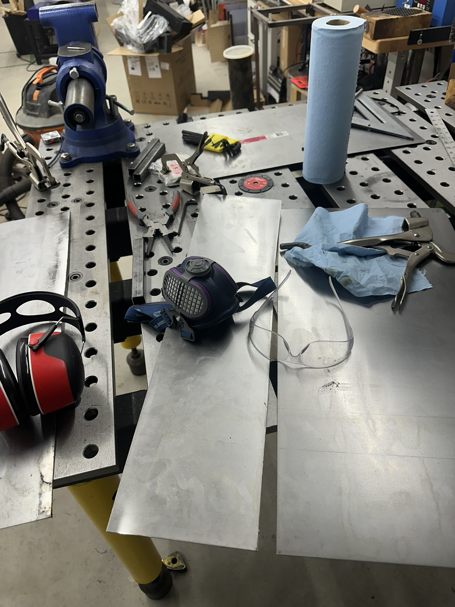
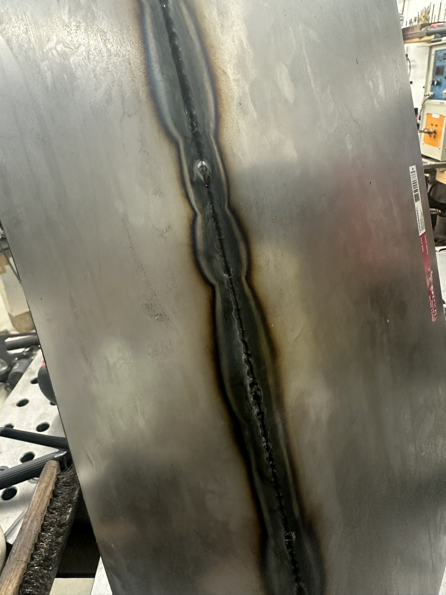
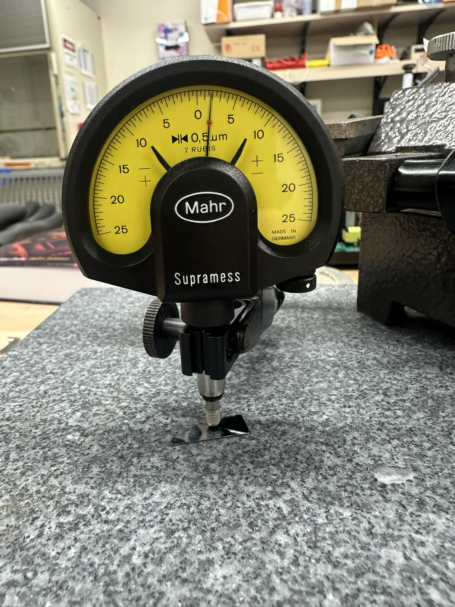
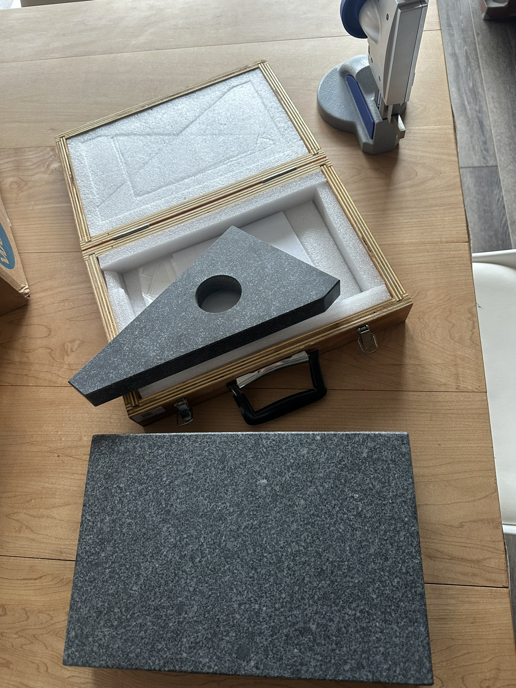
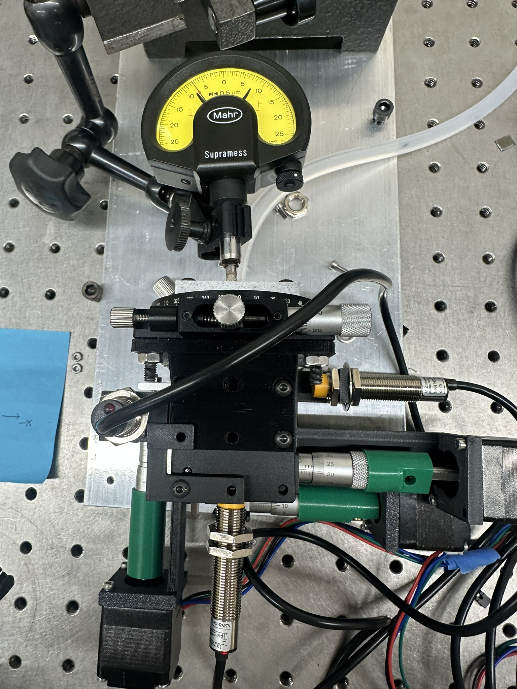

# Michael Juan

## **Update 0**

Focus for this week is to create a plan to quantify the errors in the current litho stepper. Work on my tormach 440 cnc machine to have "in house" machining capability.&#x20;

Preliminary Readings: ISO 230 Geometric accuracy of machines operating under no-load or quasi-static conditions, Foundations of Mechanical Accuracy, Precision Machine Design.&#x20;

### Next Steps

Create a project proposal

***

## **Update 1 (1/26/2025)**

### Accomplishments

* Created project proposal, received input from litho-stepper team and edited the proposal by added target values for mechanical accuracy of proposed nano-positioner.
* Welded a steel coolant tank using TIG (tungsten inert gas) welding. Leak tested the coolant tank by filling it with water and waiting to see if the tank leaked. There were several pinhole leaks.

<figure><figcaption>
Cutting panels
</figcaption></figure>

<figure><figcaption>
long seam weld
</figcaption></figure>

* Looked at the cad files for this open source piezo nano-positioner. [https://www.sciencedirect.com/science/article/pii/S2468067222000621](https://www.sciencedirect.com/science/article/pii/S2468067222000621)
* Created spreadsheet of potential tooling required for CNC milling nano-positioner parts.
* Started on creating the documentation for measuring the mechanical accuracy of Stepper V2.&#x20;

### Roadblocks

**Problem 1**

Coolant tank was not watertight. suspected cause was contamination from inadequate surface prep as well as skill issues with TIG (tungsten inert gas) welding. An attempt was made to braze the locations of leaks but a second leak test was not attempted due to time.

**Proposed Solutions**

* Grind out areas that have leaks, weld the leak locations again.
* Buy a coolant tank.

**Problem 2**

Did not finish documentation on test cases due to time overrun with coolant tank task.

**Proposed Solution**

Carry over task to the next week.

**Problem 3**

Unsure about who reviews my gitbook updates as well as github project tracker usage.

**Proposed Solution**

Ask at the next meeting.

### Next Steps

**Measurement:**

* Measure the mechanical accuracy of Stepper V2.

**Machining:**

* Order tooling.
* Order material.
* Tram the head of the CNC machine.
* PI tune CNC machine spindle motor.

**Nano Positioner:**

* Create a plan for machining mechanical parts of the nanopositioner.
* Work on CAM (computer aided manufacturing) for one loose tolerance part.

**Carry Over Tasks:**

* Create and document plan to measure the mechanical accuracy&#x20;

***

**Update 2 (2/2/2025)**\

### Accomplishments

**It is important to note that I am following axis orientation of the Stepper GUI, which is not consistent with industry norms.**&#x20;

_Link to testing results spreadsheet:_ [_https://docs.google.com/spreadsheets/d/1kp33Uu0bnELoj7gj8I\_tnA5ZHgbyOgtRBmU556TN2yw/edit?gid=457045106#gid=457045106_](https://docs.google.com/spreadsheets/d/1kp33Uu0bnELoj7gj8I_tnA5ZHgbyOgtRBmU556TN2yw/edit?gid=457045106#gid=457045106)

_Link to test procedure document:_

[_https://docs.google.com/document/d/1GBycb5NIzfImCTrVROQhtj5\_gETUNBXJAFKQSsnJRk8/edit?usp=sharing_](https://docs.google.com/document/d/1GBycb5NIzfImCTrVROQhtj5_gETUNBXJAFKQSsnJRk8/edit?usp=sharing)

*   Created a SOP for checking the parallelism  of wafers. &#x20;

    * The highest point and the lowest point were 7 microns apart. This could be due to residue from the cleaving the wafer, manufacturing tolerances, or small amounts of contamination that was not cleaned off through washing with acetone and isopropanol.
    * Did an informal test on contamination. Sharpie marks are around 2.5 micrometers, and finger smudges are measurable under 0.5 micrometer.

<figure><figcaption></figcaption></figure>

* Tested the backlash on the x and y axis of stepper at 10 positions each.&#x20;
  * The fixes for the X and Y axis by Carson resulted in less that 10 micron backlash.&#x20;
  * The backlash on the Z axis was so bad that it over-traveled my indicator. (will test it after a proposed fix)
* Tested the step accuracy of the stepper in 10 micron, 5 micron, 2.5 micron, and 1 micron increments.&#x20;
  * Steps were consistently inconsistent. (see linked spreadsheet)
  * &#x20;At smaller steps such as 1 micron there would often be no movement even after a command.&#x20;
* Did initial testing on squareness of axes. Initial testing with a 2 micron indicator and a granite square suggests that x and y axis squareness is not a issue.

<figure><figcaption></figcaption></figure>

* Did initial testing of how parallel the vacuum held wafer was to the axes.
  * I did not bring my course indicators because I assumed the error would be in the micron range. The error was higher than what my  indicators could measure.
  * Initial testing suggests that the vacuum is bending the wafer.
*

    <figure><figcaption></figcaption></figure>
* Performed manual PI tuning for CNC machine spindle motor.

### Roadblocks

**Problem 1**

**Did not get to test positional repeatability of axes. repeatability of limit inductive sensors, and hysteresis of limit sensors.**&#x20;

**Proposed Solutions**

Perform test on Tuseday 02/04/2025

**Problem 2**

Testing by manually typing g-code is slow. Even though most of the time spent was manually adusting the dial indicator there is speedups fr

**Proposed Solutions**

Create a gcode script if testing is going to be an ongoing thing.

### Next Steps

**Measurement:**

* Test the positional repeatability of axes, limit inductive sensors, and hysteresis of limit sensors.
* Converts notes from testing to repeatable SOPs.
* Test longer travel distance accuracy of axes.

**Machining:**

* Order tooling. (carry over)
* Order material. (carry over)
* Tram the head of the CNC machine. (carry over)

**Nano Positioner:**

* Work on CAM for the top plate of open source nanopositioner. Because there are no tolerances in the paper create a dimensioned drawing with best guess tolerances.
* Work on creating a simpler way of testing piezo nano positioning. (Sanity check)

### Final Notes/takeaways.

Inaccuracies of small steps (<10 micron) seems to be from motors lacking torque to micro step. friction/binding in the system.

Mechanical accuracy of z axis is so bad that its functionally unusable. (a fix has been proposed and is currently being implemented by Carson )&#x20;

The axis orientation of the stepper do not follow industry norms. This should be updated to prevent confusion.

even though the surface of the wafer is almost atomically flat. the bottom and top layer are not necessarily parallel.

The 3d vacuum wafer holder is tilted significantly.

&#x20;

&#x20;

