# Yuichi Hirose

### **Weekly Update #0&1 (1/13 - 1/26)**

#### Accomplishments

* I was first assigned to the wire bonder development. I joined the wire bonder tutorial with Joe and Joel to get to know how to use it. I had a discussion with Icey, James, Joe, and Joel, and we decided to prioritize the probe station development and the other parts of IC packaging except DIYing a wire bonder for this semester. I was assigned to the development of a probe station.
* I had a discussion with Anirud and Joel to understand the current situation of the probe station (what have been finished, what not, and what I am supposed to do this semester). Anirud showed me the current prototype from last semester, which helped my understanding.
* I looked through [the documents and CAD from the last semester](https://drive.google.com/drive/folders/1IgyzVxSDXMU6CBSJqW16NdSuTSvhQFkJ) to understand the situation more.
* I created [a project proposal](https://docs.google.com/document/d/1_nHKy9RG0kd6QQrEui08GBJlWizaZtv6Z8CEiLkyzpo/edit?usp=sharing).
* I had a discussion with Anirud, Joe, and Joel again to review my project proposal.
  * We decided to use off-the-shelf XYZ positioners and work on a DIY XYZ positioner develepment only if time allows.
  * Because we are going to use off-the-shelf XYZ positioners, we catn also use off-the-shelf probes. We don't have to design and DIY them.
  * The camera can be replaced with a USB camera. Another team is also procuring one, so it might be good to obtain the same one for us. C-mount cameras might be benefitial for easy design and assembly.
  * Vacuum chuck is necessary. Lab already has a vacuum pump. We need to obtain a chuck (the one procured last semester is too large).
  * We would like to automate the Z-axis positioning. We need to attach a motor to the Z-axis of the off-the-shelf positioner.
  * Priority: finishing a working DIY probe station > auto-Z function.

#### Roadblocks

* These tasks might already be underway by someone, but I'll write down for record
  * XYZ positioner procurement
  * Probe procurement
  * USB camera procurement
  * Vacuum chuck procurement
* How to implement auto-Z? (Force sensor? High-res encoder?)

#### Plans for next week

* Design of a metallic base which XYZ positioners can be attached with magnet.

### **Weekly Update #2 (1/27 - 2/2)**

#### Accomplishments

* I made drawings for the designs of the base.\
  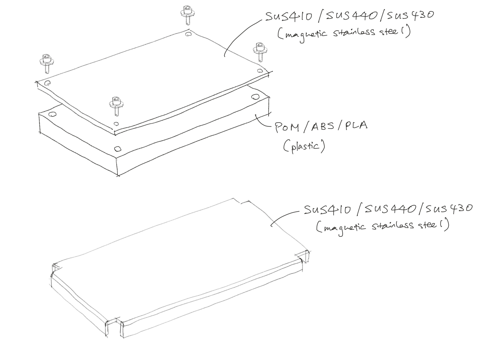
* I looked up metalic boards which might work as the base. If they work, we don't have to make something like the ones above.\
  [https://a.co/d/2TJwnC9](https://a.co/d/2TJwnC9)\
  [https://a.co/d/78COEFO](https://a.co/d/78COEFO)
*   In order to set the state where the positioners are placed higher than the chip (the probes usually go downward from the positioners), we should either

    1. elevate some parts of the stage for the positioners like this:\
       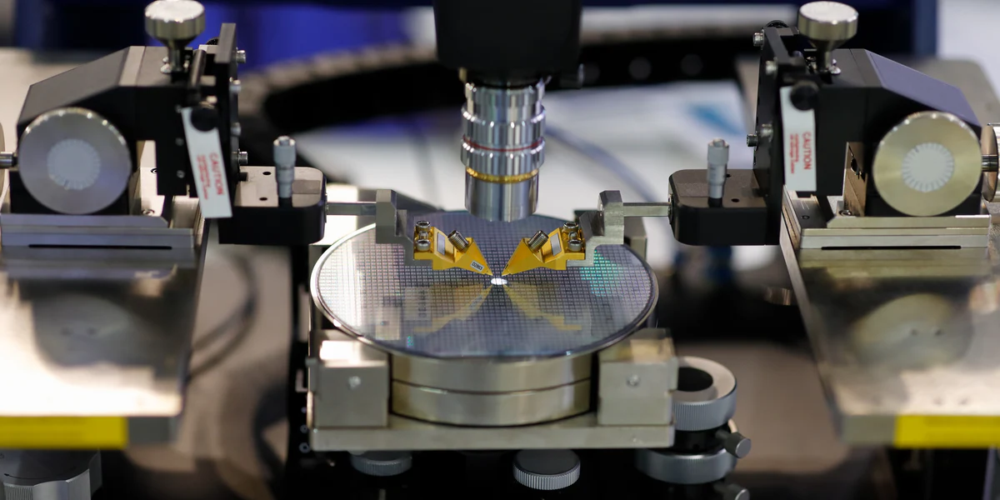\
       [https://www.ossila.com/pages/what-is-a-probe-station](https://www.ossila.com/pages/what-is-a-probe-station)
    2. or elevate the positioners themselves like this:\
       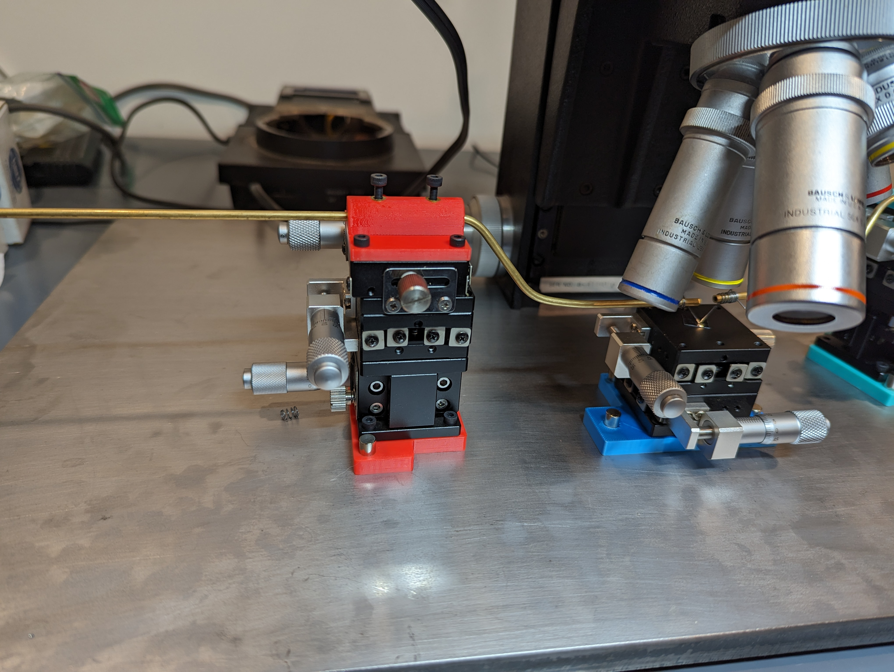\
       [https://x.com/BreakingTaps/status/1719132030972182728](https://x.com/BreakingTaps/status/1719132030972182728)

    I assume the design 2 will cost less and will be much easier to make. I can't find any downsides of this design. So we decided to go with the design 2.
* Anirud and I decided to procure and try [the Amazon $125 XYZ stage](https://a.co/d/9o7FYxc) instead of [the $700 positioner](https://www.quater-research.com/all-products/XYZ-300-TEST-Micro-Positioners-p132789603) first, refering to [this design](https://x.com/BreakingTaps/status/1719132030972182728).
* I made drawings for the designs of the attachement to connect the Amazon XYZ stage with the [probe holder](https://www.quater-research.com/all-products/20249-Test-Arm-Holder-p136536837).\
  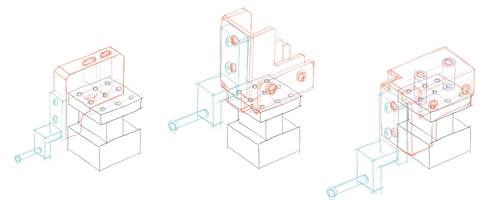
* I discussed with Anirud about his idea on the auto-Z implementation using a piezo vibration sensor like [this](https://a.co/d/aGbvlkL). He drilled a hole in the center of the sensor, which is for the vacuum chuck, and it sill worked. He told me that the burrs around the hole can be a problem. I think putting a backup board (sacrificial board) under it when drilling might reduce the burrs. Or we can put a conductive spacer, with a larger hole avoiding the burrs, between the sensor and the chuck.

#### Roadblocks

* Camera selection

#### Plans for next week

* Design an attachment to put magets to the bottom of the Amazon XYZ stage
* Design a vacuum chuck

### **Weekly Update #3 (2/3 - 2/9)**

#### Accomplishments

* Anirud and I procured [the Amazon XYZ stage](https://a.co/d/aHYNNB5), [Quater Research's needle and test arm](https://www.quater-research.com/all-products/20235-Needle-and-Test-Arm-p136536804), and [test arm holder (probe holder)](https://www.quater-research.com/all-products/20240-Test-Arm-Holder-p136536825). \
  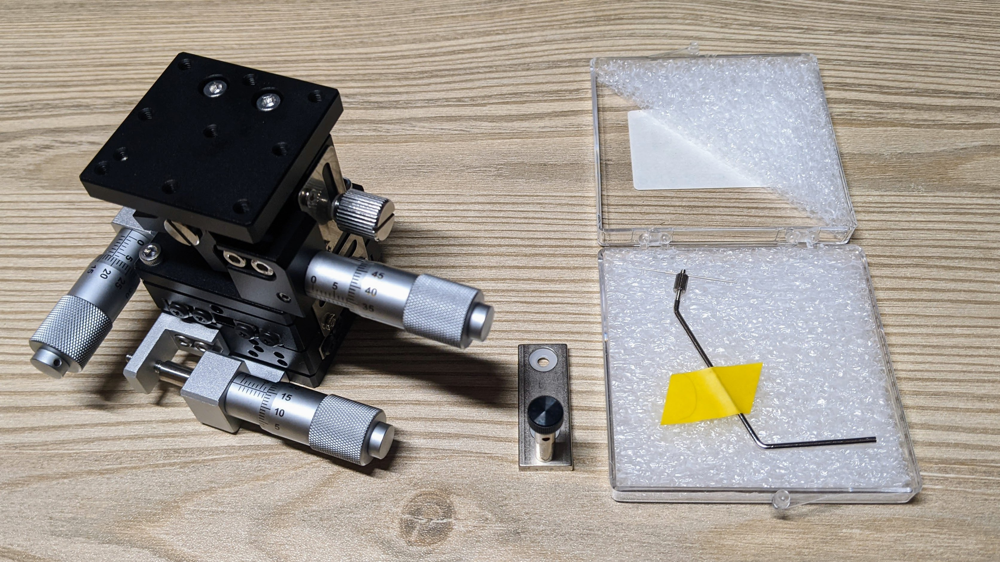
* I created [CAD models of the needle and test arm, and the test arm holder](https://cad.onshape.com/documents/fee12d8a7495391c1cc1a75e/w/288c070f2db1c77a6048584a/e/e1ec7cdf2dc20b8eaae96cf2?renderMode=0\&uiState=67a97e6692577636febb3fc3). I found a CAD model of [a similar XYZ stage on Misumi](https://us.misumi-ec.com/vona2/detail/221000831513/?HissuCode=LT-4047-S1), which has the same key dimensions as the one from Amazon.\
   (1).png>)
* I added constraints ("mates") to the XYZ stage model to simulate the range of motion.\
   (1).png>) .png>)

#### Roadblocks

* Camera selection

#### Plans for next week

* Create a CAD model of an attachment for the probe holder
* Design an attachment to put magets to the bottom of the Amazon XYZ stage
* Design or procure a vacuum chuck

### **Weekly Update #4 (2/10 - 2/16)**

#### Accomplishments

* I designed an attachment for the probe holder, a magnetic base for the XYZ stage, and created their CAD models.

<figure><figcaption>
Probe station design
</figcaption></figure>

* I looked up and selected [a magnet](https://a.co/d/fau0k1t) and [a magnetic board](https://a.co/d/cXXv0Iq) on Amazon.
* I checked [the lab-made patterning stepper device](https://docs.hackerfab.org/home/archive/patterning-sop-stepper-v1), which our probe station would have a similar structure to. I found that this design is based on the idea that the micrometer handle of the XYZ stage is rigidly connected to the motor, without something springy such as couplers, while the motor is connected to the stage flexibly using a long, thin 3D-printed beam (the motor axis and the micrometer axis cannot be aligned perfectly, so either of them needs to be flexible). I guess, this is also because, for the patterning stepper we need to attach a motor for every X/Y/Z-axis and there is not so much space for it, so the beam needed to be thin. For the probe staion, we need automate only the Z-axis, so I think I would go with the opposite way (rigidly fix the motor to the stage, and flexibly connect the motor and the micrometer). I anticipate that this contributes to the overall stability of the positioner, because the motor would not wobble in that case (it still needs to slide in 1 DoF along with the micrometer handle).

<figure>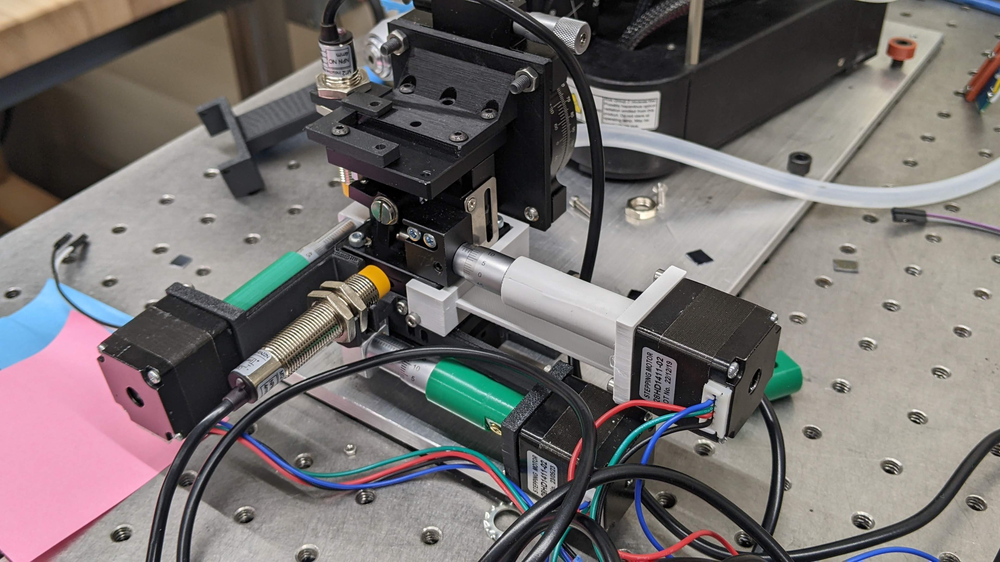<figcaption>
Lab-made patterning stepper
</figcaption></figure>

<figure><figcaption>
Lab-made patterning stepper
</figcaption></figure>

* I checked [the motor](https://www.canadarobotix.com/products/2682?srsltid=AfmBOooUm0NnSnAPh-sQfM5d7ajIlJsF4AItUQzzjvZxIG14Fq03K1So) of the patterning stepper. It has 200 steps/rev resolution. If we use the same motor in the full step mode, and directly connect it to the micrometer without speed reduction, then the resolution of our device is 2.5 um. I discussed with Joel and confirmed that this is sufficient resolution for the probe station, because the pad size length and width will both be >100um.
* I discussed with Anirud and Joel whether our probe station needs proximity sensors like the patterning stepper. Because it does not need absolute positioning, we concluded that the sensors are not necessary.
* I had a discussion with Anirud and Joel about how to hold a chip on the XY stage. We are planning to use the piezo vibration sensor to detect the touch by the probe needle to the chip, for the auto Z-zero setting function. Also, the surface where a chip is put needs to be conductive for testing purposes. The problem is the piezo sensor is larger than regular chips and its face and back sides are not electrically connected. One idea is, if we use a vacuum chuck, to attach conductive tapes on the piezo sensor avoiding the vacuum suction hole so that the chip is positioned on top of the tape, and the bottom of the chip and the tape are electrically connected. Another idea is to use a double-sided conductive tape, instead of a vacuum chuck. In this case, we should fix the piezo vibration sensor using a regular tape, and attach the double-sided conductive tape on top of the regular tape, so the sensor will not be damaged when we replace the double-sided tape.

<figure>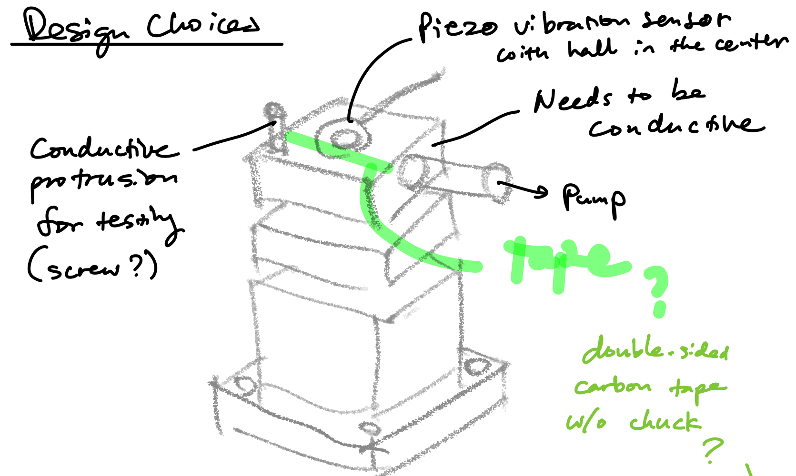<figcaption>
Sketch for the chip holding idea (vacuum chuck)
</figcaption></figure>

<figure>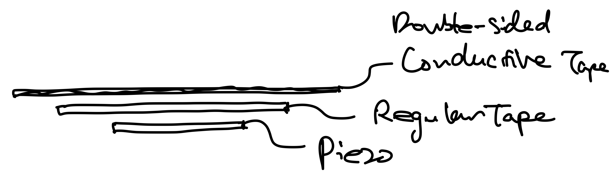<figcaption>
Sketch for the chip holding idea (double-sided tape)
</figcaption></figure>

* By checking the patterning stepper, I realized the vacuum chuck can be 3D printed. It doesn't have to be a machined aluminum part.
* I had a discussion with Anirud and Joel about the camera. A cheap USB microscope like [this](https://amscope.com/products/utp200x003mp) seems sufficient.

#### Roadblocks

* How to hold a chip on the XY stage (details above)

#### Plan

* 3D print the attachment for the probe holder and assemble
* 3D print the magnetic base for the XYZ stage and assemble
* Procure magnets
* Design a vacuum chuck / test double-sided conductive tape for holding a chip on the XY stage

### **Weekly Update #5 (2/17 - 2/23)**

#### Accomplishments

<figure>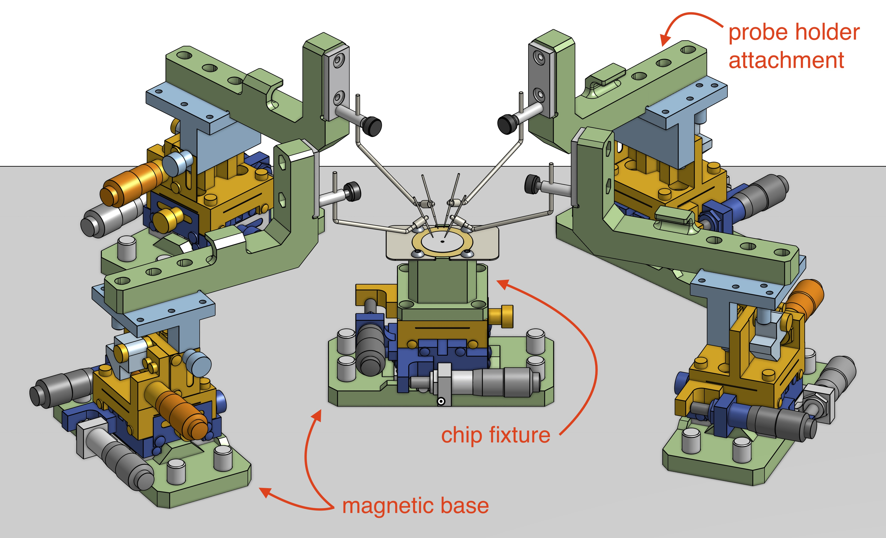<figcaption></figcaption></figure>

* 3D printed the attachment for the probe holder and assembled\
  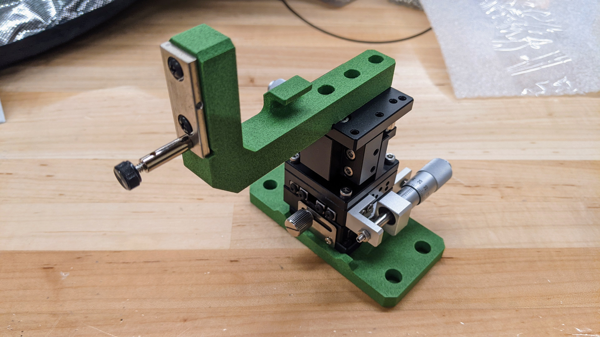 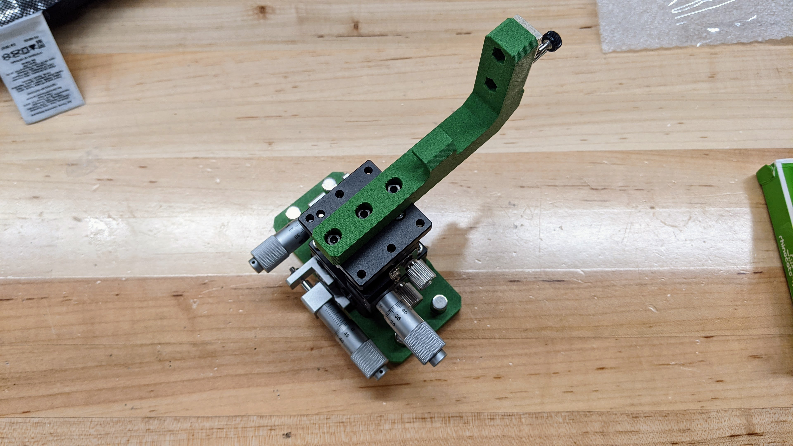
  * It looks fine. No problem with assembly. We need to check if the tip of the probe needle moves correctly using a microscope (one of the probes of the probe station we currently use doesn't look moving orthogonally when we rotate the handles for X and Y axis, which makes manipulation difficult and annoying. We need to check if the one I just assembled does not move like that).
* 3D printed the magnetic base for the XYZ stage, procured magnets and assembled\
  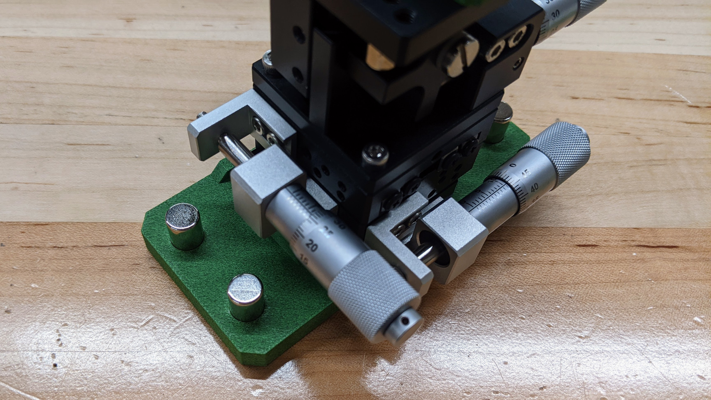 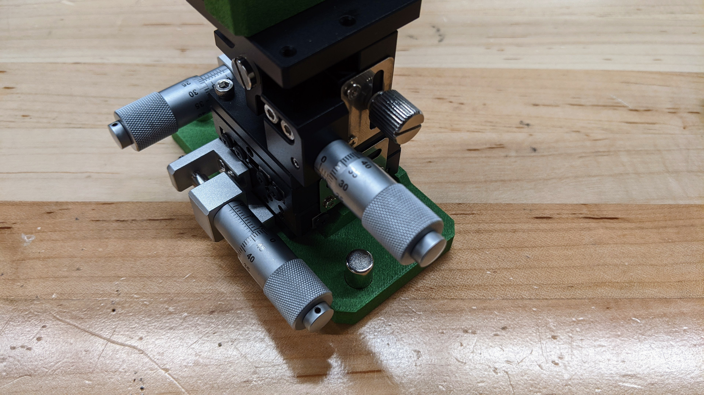
  * It looks fine. No problem with assembly. We need to check if the magnets are too weak or too strong on the magnetic board like [this](https://www.amazon.com/dp/B007UHG7KI).
  * I used [this magnet](https://a.co/d/aqNHS0h).
  * The base felt a bit too close to the micrometer handle and it was a little hard to rotate. I will probably modify the design.\
    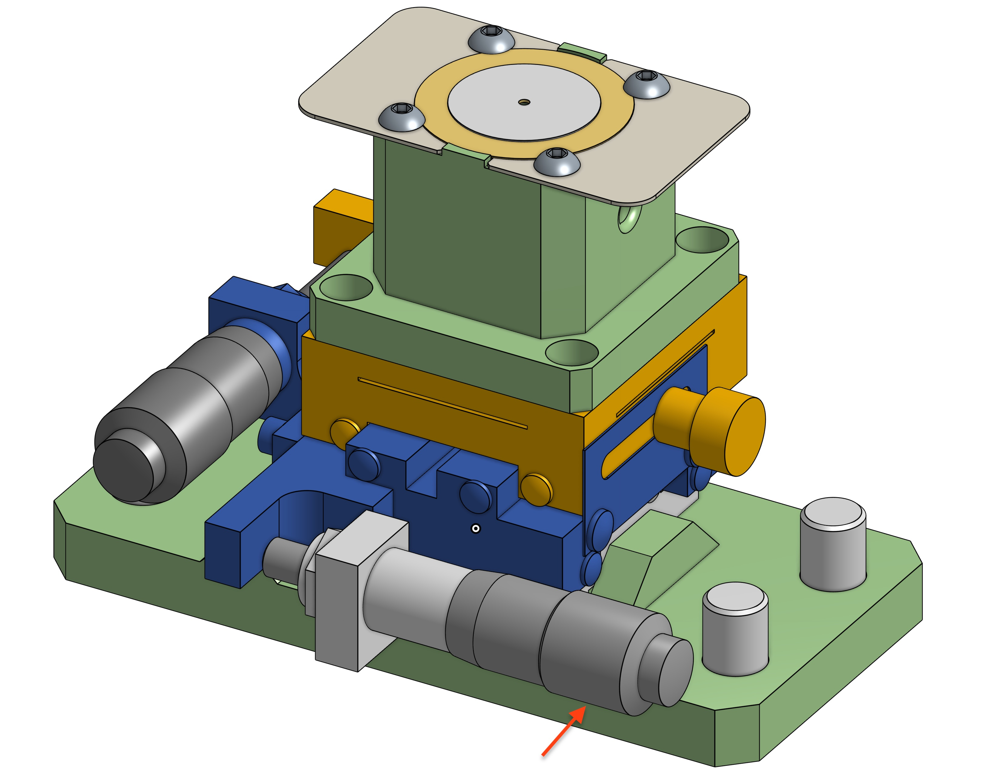
  * (forgot to take a photo of the 3d printed part and the assembled device. I'll add it on Monday)
* Designed the chip fixture (vacuum chuck)
  * I designed the chip fixture. While I temporarily prepared a hole for a vacuum chuck, we are now leaning towards using double-sided conductive tape for chip holding instead. This is because we need to put conductive tapes on the piezo vibration sensor anyway to test the bottom of the chip, and we want to avoid a situation where the sensor is also sensitive to the vibration caused by the pump for the vacuum chuck, macaking it difficult to isolate the vibrations when the probe needle touches the chip surface. Also since double-sided tape is easier to test with than a vacuum chuck, we will start with double-sided tape.\
     (1).png>)
* Ordered [double-sided conductive tape](https://discord.com/channels/1143959339179200562/1329845066033922069/1342269476732665999) and [camera (USB microscope)](https://amscope.com/collections/digital-microscopes-hand-held-microscope/products/utp200x003mp).
* Tested the piezo vibration sensor for multiple touches by probe needles
  * I had a concern on whether the sensor works well with a touch by a needle when another needle is already touching (there are four probe positioners). I conducted [a rough test](https://drive.google.com/file/d/1WGoAcgL6_hh3nQNotX5qRmlBqKc43kJo/view?usp=sharing). It seems working fine, but we need to test in an actual setting.
* Considered the motor attachment design for the auto Z-zeroing function.\
   (1).png>)
* Modified [the project proposal](https://docs.google.com/document/d/1mPezRVWu7PNa3ggTOlxjDEdb9D6B84CEXgIU-5ACNHs/edit?usp=sharing) in accordance with the fixed schedule.
* Created [the 1st checkpoint slides](https://docs.google.com/presentation/d/1tlnXbdm_S4oZerqLOZx2ODcKvoIJ7EftKB4GgxjC8XI/edit?usp=sharing).
  * Feedback from the 1st checkpoint presentation:
    * Is the focusing distance of the USB microscope sufficient to allow it to be positioned above the probe needles while still maintaining focus?\
      -> The webpage says "the digital microscope can work from varying distances," sounding it would be fine (I can't find detailed information).
    * Does the pump for the vacuum chuck affect the piezo vibration sensor?\
      -> We should try the double-sided conductive tape first.
    * If the chip is tilted, the probe needle might accidentaly contact it while moving in the X or Y axis. How can we prevent this?\
      -> We should probably implement a function to sound a buzzer in such cases.
    * We should probably test the piezo vibration sensor on the off-the-shelf probe station we currently use to check if it works well.

#### Roadblocks

* None in particular

#### Plan

* After we procure the USB microscope, check if we need to design additional parts (since it originally comes with a stand, I don't expect anything else will be needed).\

* Select and order a magnetic board for the base of the probe station, like [this](https://www.amazon.com/dp/B007UHG7KI).
* Order [the measurement device](https://digilent.com/shop/analog-discovery-3/).
* Modify the design of the magnetic base for the positioners.
* Prepare 2 sets of the probe positioners and and 1 stage positioner (chip fixture) and test with the measurement device / a micrometer.

### **Weekly Update #6 (2/24 - 3/2)**

#### Accomplishments

* I modified the design of the magnetic base to make it easier to rotate the micrometer handle.\
   (1).png>) \
  previous design\
  .png>)\
  new design
* I modified the design of the stage positioner to fit the vacuum pump tube (we are not sure yet whether to go with the vacuum chuck or the double-sided tape for chip holding, but adding the extrusion does not hurt anything).\
  .png>) \
  previous design\
  .png>)\
  new design
* I printed parts for one probe positioner and one stage positioner. Since I have already assembled one probe positioner, we can test a chip after assembling them.\
  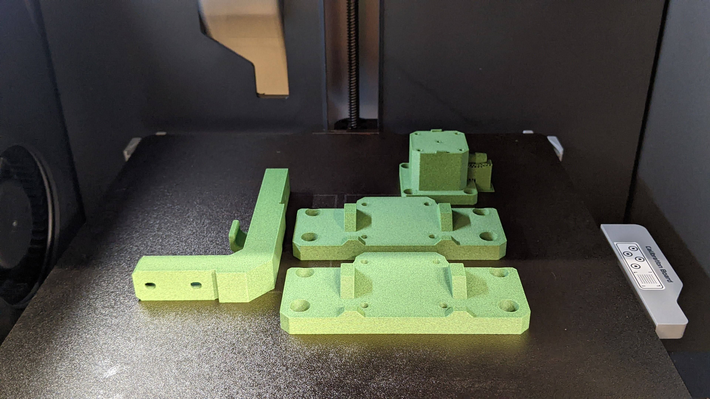
* I tested the procured USB microscope.
  * \
    The display is colored red even when hue is set 0, and a little dim even when the light is on. I'll try to figure out how to fix them next week.
  * &#x20;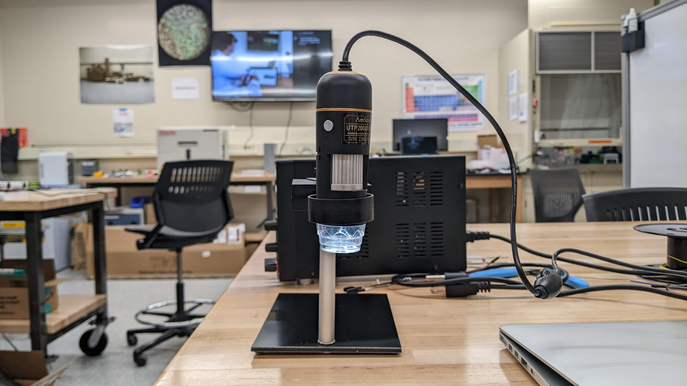\
    I found the microsope stand to be a little cheaply made. Although it seems okay for testing, it tilts and wobbles, which might affect measurement. We need to design a fixture to hold the microscope ourselves in that case.
* I selected [a magnetic board](https://a.co/d/1YdDGTl) by checking the size of the USB microscope and positioners.\
  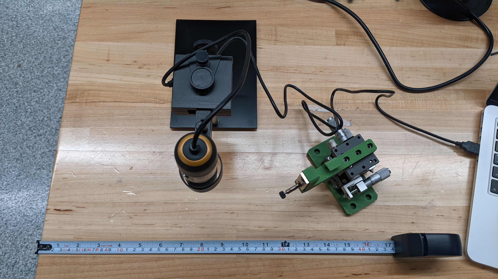

#### Roadblocks

* None in particular

#### Plan

* Fix the hue and brightness issue on the USB microscope.
* Test how stably the probe needles move in X and Y- axis using the USB microscope.
* Assemble 1 probe positioner and 1 stage positioner.
* Measure an actual chip, the one we made in the resistor lab session, using the measurement device or a multimeter to check if our probe station works as well as the one we currently use (compare measured values between them).
* Test the piezo vibration sensor for the auto Z zeroing function. Manually rotate the Z-axis micrometer handle and check if it can detect the touch.
* Consider attaching a rotational stage to the stage positioner (I discussed with Icey and Joel that it could be more convenient to enable the stage positioner rotate).

### **Weekly Update #7 (3/10 - 3/16)**

#### Accomplishments

* I fixed the hue and brightnesss issue on the USB microscope. I downloaded and installed [the software](https://amscope.com/pages/software-downloads) (AmScopeAmLite for Mac, Microsope model #: UTP200X003MP) again then that just fixed the issue. The problem is that the magnification, 10X (and up to 200X digital zoom), is not sufficient for our chip (one pad: 181.48 μm \* 76.25 μm). Additionally, the LED lights reflect straight, which worsened the visibility of the pads. We should prepare a much better microsope.\
   \
  \
  .png>)\
  (^ This picture was taken using the better microsope in our lab.)
* I chatted with Sky about the microscope and he told me that the lab already has a spare C-mount camera (AmScope MU1603) and several lenses.\
  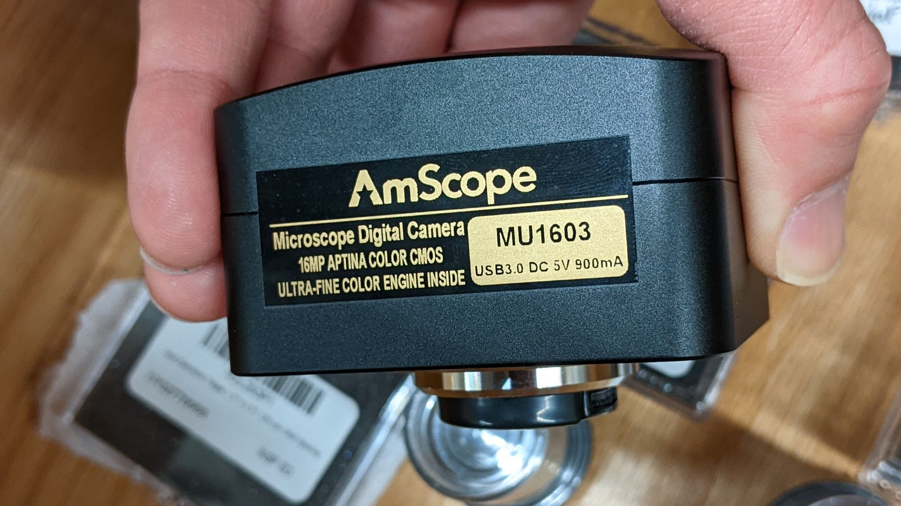\
  I also found a lens and a camera(?) connected to it from previous semesters in the probe station box.\
  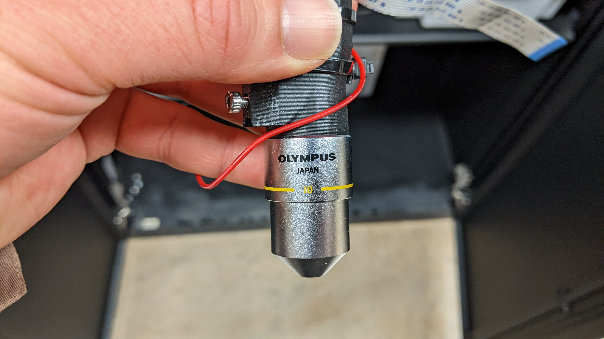 .jpg>)\
  I will look into them up to prepare for a better microscope setup.
* I checked the stability of the X- and Y-axes movement of the stage (using the 10X USB camera for now). It looks working well. The X- and Y- axes look diagonal to each other.\
  [video](https://photos.app.goo.gl/BHYFQcSj3QxZCXi79)
* I assembled one probe positioner. The new design of the magnetic base, notched around the micrometer handle which was discussed in the prevous update, made it easier to manipulate the handle. The magnetic force felt just right, although it is much weaker compared to the one for the current probe station. I think this one is better since it makes it easier to move the positioners while still preventing them from moving too easily (Opinions from others should also be considered).\
  As for the stage positioner (chip positioner), which I originally planned to finish assembling this week, I found that we needed to order one more XYZ stage for it. Since we are discussing adding the rotational axis to the stage positioner as discribed in the previous weekly update, I'll order [the XYZR stage](https://a.co/d/4oJKznA) and modify the entire design. This week I assembled other part of the stage positioner for testing\
  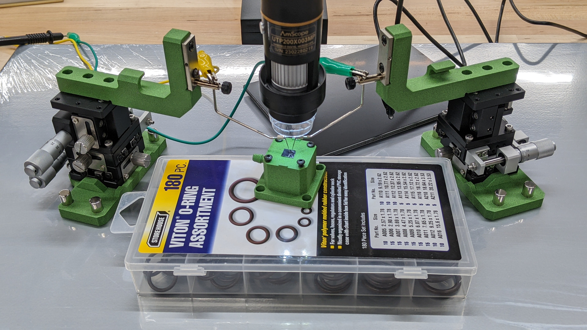\
  I tested a chip without XY stage for the stage positioner this week.
* I measured the actual chip we made in the resistor lab session using the 10X USB microscope and a multimeter. There seems no problem with probe positioners. The thing is that the chip was not stable and shaky. When the probe needle touches the chip surface while the other probe needle is already in contact, it seems that the second touch tilts the chip, causing the first needle to lose contact. I was using a multimeter to measure the resistance, and it showed a resistance very breifly and went overload. The shown values seem fine.\
  [video](https://photos.app.goo.gl/wNMgwTrKKmYp2jdN9)\
  Shown values: 100.7 ohms, 96.5 ohms, 107.3 ohms, 183.5 ohms, 132.3 ohms\
  Actual values (measured with the current probe station): 149 ohms\
  \
  Possible causes for the unstability are\
  1\. the surface of the 3D printed chip stage is not flat enough,\
  2\. the chip is not flat enough, and/or\
  3\. the entire testing setup is too unstable (the O-ring box was not stable at all).\
  I will order the XYZR stage anyway. I'll test with it and see whether it can imrove the stability. I'll also look into the current probe station and check how it allows chips to be placed stably.
* I tested the piezo vibration sensor on the chip stage part. It is working fine.\
  [video](https://photos.app.goo.gl/xVAVTerKq3uzjD4U9)
* I tested a vacuum pump with the chip stage. It's working well. This might improve the stability discussed above. I will test the resistance measurement using it next week.\
  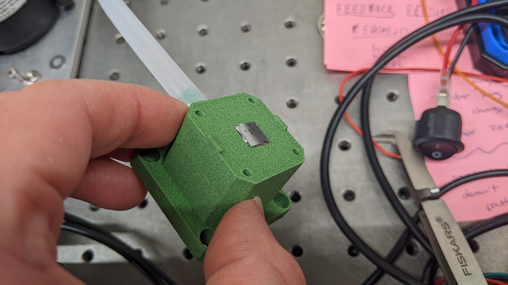\
  But with the piezo vibration sensor, the chip was unstable and shaking.\
  [video](https://photos.app.goo.gl/eD4Hwfh7nqAuAfRj7)\
  This must be because of the dents around the hole and maybe also because of the original flatness of the sensor. It would be difficult not to have the dent when drilling, we need to come up with some design to avoid this issue, such as attahcing some parts on the sensor, and placing the chip on these parts. We need to check if the sensor still works well in this setup. We are now prioritizing finishing the probe station without the auto Z-axis zerong function, so I'll give this issue a lower priority (but also I started thinking that it is really helpful to have the sensor with a buzzer or something even if we can't finish the auto Z function this semester).\
  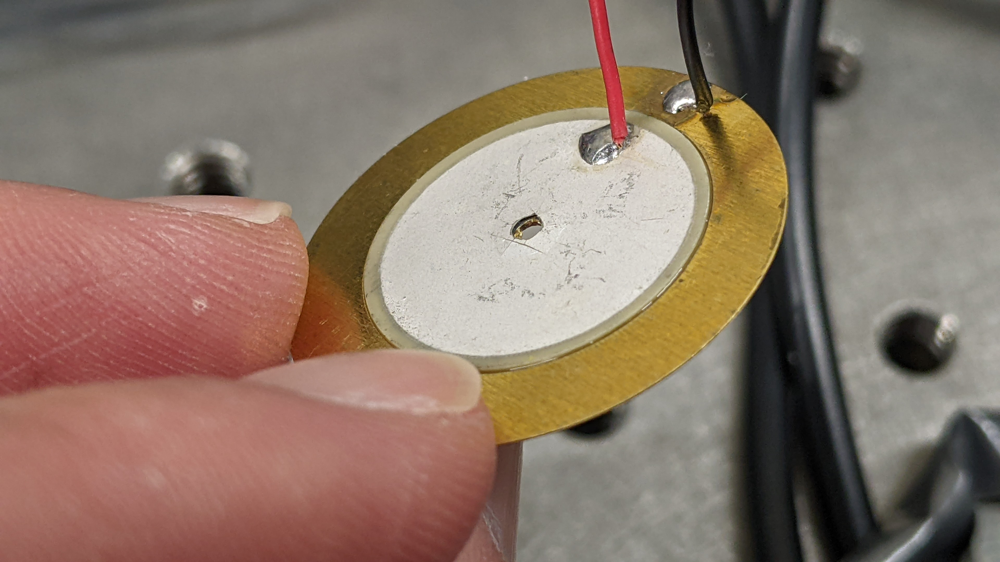 
* I found [a nice AmScope manual](https://mmrc.caltech.edu/Microscope_Camera_AmScope/Software/AmScopeSetup_v3/AmScope_enhelp.pdf) (haven't read through everything).

#### Roadblocks

* [The double-sided conductive tape](https://www.amazon.com/dp/B097JQQ7SC) we ordered 3 weeks ago (#205 of the [purchase tracker](https://docs.google.com/spreadsheets/d/1q8bCldE8gXcriELmI92WnKogdQQfaplEABGx0QJ8EXE/edit?usp=sharing)) has not arrived yet.

#### Plan

* Research cameras and lenses for a better microscope setup.
* Order XYZR stage and modify the stage positioner design to be attached to the R-axis stage.
* Conduct the chip measurement test using the vacuum chuck to see if it improves the chip placement stability.
* Modify the stage positioner design for chip to be placed more stably (if necessary).
* Conduct the piezo vibration sensor test using the vacuum chuck to see if the vibration from the vacuum pump affects the result.

### **Weekly Update #8 (3/17 - 3/23)**

#### Accomplishments

* I researced cameras and lenses for a better microscope setup, especially the C-mount camera (AmScope MU1603) left in the drawer and the objective lens (Olympus E A10) left in the probestation box.\
  \
   .jpg>)\
  These are how I understand (please correct me if I'm wrong):
  * 160 of  "160 / -" written on the objective lens is the tube length \[mm] of a tube placed between the lens and the camera (= the length between the mounting surfaces of the lens and the camera).\
    .png>)\
    [https://build.openflexure.org/openflexure-microscope/v7.0.0-beta1/info\_pages/imaging\_optics\_explanation.html](https://build.openflexure.org/openflexure-microscope/v7.0.0-beta1/info_pages/imaging_optics_explanation.html)\
    -> Is it a common way to achieve this by buying several tubes like [this](https://a.co/d/eTDqlJl) and connecting them to be 160 mm as total (or 3D printing a 160 mm tube), and a [C-mount adaptor for objective lenses](https://a.co/d/j5VsfJK)? I'll ask the litho stepper team.\
    .png>)\
    .png>)\
    [https://a.co/d/eL2YPvg](https://a.co/d/eL2YPvg) / [https://a.co/d/6nrxMbO](https://a.co/d/6nrxMbO)
  * \- of "160 / -" written on the objective lens indicates that it is the lens used without a cover glass.\
    If it says 0.17, it needs to be used with 0.17 mm thick cover glass.
  * 0.25 written on the objective lens is numerical aperture. It affects the brightness and the resolution (the higher value, the brighter and higher resolution), and it's usually around 0.1 to 1.6. So 0.25 seems a low value, but I'm not sure whether it's sufficient for our purpose.
  * [AmScope 1603](https://amscope.com/products/mu1603) has the 16MP resolution, which means \~16M pixels, e.g., 4608 × 3456 (aspect ratio 4:3), 4928 × 3264 (3:2), or 5120 × 2880 pixels (16:9). \
    Because the sensor size of the camera is 6.18 x 4.66 mm, and the pixel size is 1.335 \[μm], so it should be 4629 × 3490 pixels.
  *   (magnification) = (sensor size) / (field of view)\
      ⇔ (field of view ) = (sensor size) / (magnification)\
      If we use the camera, which does not magnify to( my understanding) and the 10x lens, the filed of view is:

      Width: 6.18 mm / 10 = 0.618 mm = 618 μm\
      Height: 4.55 mm / 10 = 0.455 mm = 455 μm\
      And we will have the 4629 × 3490 pixels resolution in this field of view, which sounds very high.\
      This is an example of the chip we want to observe:\
      \
      The entire chip looks like \~900 x 450 μm. The 618 x 455 μm field of view is too small for this purpose (we need to observe not one pad but a whole chip for probe stations). We should use a lens with smaller magnification or a camera with a larger sensor size.
  * Conclusion
    * Ask the litho stepper team about the tube
    * Ask the litho stepper team about the numerical aperture
    * Find a lens with smaller magnification or a camera with a larger sensor size
  * Reference: \
    [https://www.microbehunter.com/about-the-numbers-on-the-objective/](https://www.microbehunter.com/about-the-numbers-on-the-objective/)
* I ordered [the 60 x 60 mm (Ø60 mm) XYZR stage](https://a.co/d/8USxJmG). There are several 40 x 40 mm stages left in the lab, but I couldn't find a reasonable 40 x 40 mm (Ø40 mm) rotation stage on the Internet. They are as expensive as or more expensive than the 60 x 60 mm, like these:\
  [https://www.msesupplies.com/products/mse-pro-precision-rotation-stages-countertop-size-o40mm](https://www.msesupplies.com/products/mse-pro-precision-rotation-stages-countertop-size-o40mm)\
  [https://www.edmundoptics.com/p/40mm-metric-rotary-stage/11792](https://www.edmundoptics.com/p/40mm-metric-rotary-stage/11792)\
  [https://www.edmundoptics.com/p/40mm-english-rotary-stage/21014/](https://www.edmundoptics.com/p/40mm-english-rotary-stage/21014/)\
  So I just ordered the set of 60 x 60 mm XYZ stage and Ø60 mm R stage on Amazon.
* I set up the vacuum chuck.\
  .png>)
* I conducted some tests to improve the chip placement stability.
  * Press the magnetic board\
    -> The board is not rigid enough, which clearly affects the stability. We need to replace it with a more rigid one.\
    [video 1](https://photos.app.goo.gl/wRY5SFBSguRgEdKv8) [video 2](https://photos.app.goo.gl/3DmWa68w391o6Y1Q7)
  * Use the vacuum chuck\
    -> It improves the stability significantly. But the chip still tilts when the probe makes contact. I need to check with a better camera with a larger multiplication if it's already stable enough, but we should try making a flatter surface with a laser cutter etc.\
    [video](https://photos.app.goo.gl/X4AHwotpQsj9SHqx7)
* I conducted the piezo vibration sensor test using the vacuum chuck to see if the vibration from the vacuum pump affects the result.\
  -> It affects but solvable. The problem is not the vacuum pump motor, but the flatness of the surface where chips are placed. Details: \
  When the probe was in cotact with the piezo vibration sensor, the value kept changing ([video](https://photos.app.goo.gl/qm8ADWmCNBT7mjZbA)). This is a problem because we can't determine whether a change in the value is due to the vibration or due to the second touch, which we want to detect. When holding the pump motor in the air by hand, the value became stable ([video](https://photos.app.goo.gl/vpN7HM5MAgNWbwwr9)), but when the probe is in cotact with a chip, not the sensor, it didn't ([video](https://photos.app.goo.gl/VHRFKMoZALxjjWgQA)). Actually even with the vacuum off, the value kept changing when the probe was in contact with the chip ([video](https://photos.app.goo.gl/Ryfk6LnRPLurd1ot6)). This means that the chip kept vibrating on the piezo vibration sensor and that affected the value. It should be because of the burrs around the drilled hole of and the flatness of the sensor, discussed in the last update.\
  -> The vibration caused by the pump motor is easy to avoid by placing it away from the probes and the chip, or on top of something cushiony. The flatness of the surface is a more important issue. I'm thinking of placing a board on top of the piezo sensor to avoid the burrs and to have a flatter surface (the hole of the board is larger than the hole of the sensor so it can avoid the burrs). We need to test whether the sensor still can work in this setup.\
  .png>)\
  \
  I also though of making the surface itself cushiony to absorb the unflatness of the surface and the chip, but then it would be difficult to detect the vibration.\
  \
  .png>) \
  This is the stage of the probe station we currently use. The chip was measured stably on this, which inferrs that there is no problem for the flatness of the chip. If we can have a flat surface, it would solve the issue, I believe.

#### Roadblocks

* [The double-sided conductive tape](https://www.amazon.com/dp/B097JQQ7SC) we ordered 4 weeks ago (#205 of the [purchase tracker](https://docs.google.com/spreadsheets/d/1q8bCldE8gXcriELmI92WnKogdQQfaplEABGx0QJ8EXE/edit?usp=sharing)) has not arrived yet.

#### Plan

* Ask the litho stepper team about the tube between the camera and the objective lens
* Ask the litho stepper team about the numerical aperture of the objective lens
* Find a lens with smaller magnification than 10x or a camera with a sensor size larger than 6.18 x 4.66 mm
* Modify the stage positioner design to be attached to the R-axis stage
* Modify the stage positioner design for chip to be placed more stably (place a board on top of the piezo vibration sensor)
* Conduct the piezo vibration sensor test if the sensor still works when there is a board on top of it
* Conduct the piezo vibration sensor test with something cushiony between the chip and the sensor (if necessary)

### **Weekly Update #9 (3/24 - 3/30)**

#### Accomplishments

* I asked Sky in the litho stepper team about the tube between camera and the objective lens.\
  My question was if it is a common way to achieve the 160 mm length between a camera and an objective by buying a few of [this extension tube](https://a.co/d/eTDqlJl) and connecting them to be 160 mm as total, and a [C-mount adaptor for objective lenses](https://a.co/d/j5VsfJK). He told me that it would be an easier option to find something like [this](https://www.edmundoptics.com/p/din-objective-to-c-mount-tube-assembly/11599/), which has the exact distance we need already. I noticed that the length of the tube is only 132.50 mm, or 136.50 mm including the thread, which is much shorter thatn 160 mm. He told me that part of this is because there is a 17.5 mm distance between the start of the threads on the camera side and the actual camera sensor (that's called the flange focal distance, which is specified by the spec for the C lens mount which the camera uses), which would lead to a total of 150 mm, not 160 mm. And the reason why this is 150 mm, not 160 mm, is that the actual image plane projected by the objective is 150mm, not 160mm - this means that if we're using a camera sensor instead of an eyepiece, our sensor needs to be at 150 mm not 160 mm.\
   (2).png>)\
  [https://www.edmundoptics.com/p/din-objective-to-c-mount-tube-assembly/11599/](https://www.edmundoptics.com/p/din-objective-to-c-mount-tube-assembly/11599/)\
   (6).png>)\
  [https://www.edmundoptics.com/knowledge-center/application-notes/microscopy/understanding-microscopes-and-objectives/](https://www.edmundoptics.com/knowledge-center/application-notes/microscopy/understanding-microscopes-and-objectives/)\
  I plan to first try 3D printing a tube by modifying something like [this](https://creazilla.com/media/3d-model/7864622/c-cs-mount-adapter-for-din-threaded-microscope-objectives). If I can't make it work, I'll order [this](https://www.edmundoptics.com/p/din-objective-to-c-mount-tube-assembly/11599/). To design the tube, I need to confirm these:\
  \- To make sure the AmScope camera we use has the 17.5 mm distance between the start of the threads and the actual camera sensor.\
  \-  Why does this tube have multiple sections with different diameters on the inside, indicated with the blue arrows? Are they necessary?\
  
* I asked Sky in the litho stepper team about the numerical aperture of the objective lens.\
  He told me that it should't matter in this case. It matters when we care about specific brightness and resolution, but since the probe station is targetting large pads on the chip, he thinks it really isn't a worry. My understanding is that it matters when we try to observe nanoscale objects, when it comes to the resolution. For the brightness, it matters when we somehow can't have a light near the objects, I guess? Anyways, it seems like we don't have to care about the numerical aperture for our appication.
* I found the lens with smaller magnification than 10x. Olympus E A4 (4x objective).\
   (4).png>)
* I made a board to be placed on top of the piezo vibration sensor to stabilize wobbling chips. (4).png>)  (2).png>)
* I conducted the piezo vibration sensor test if the sensor still works when there is the board on top of it. I didn't work. The board significantly decreases the sensor's sensitivity.\
  [video1](https://photos.app.goo.gl/NvgATJFFftdn53GX6) [video2](https://photos.app.goo.gl/Fae4d9VT4CcfbHfV7)
* I found that the vacuum chuck does not work with the piezo vibration sensor. Even if I hold the vacuum pump motor in the air, the air or the vibration from the tube affects the sensor.\
  [video](https://photos.app.goo.gl/6xV93jg58okfKhUGA)
* Because [the double-sided conductive tape](https://www.amazon.com/dp/B097JQQ7SC) (double-sided conductive and double-sided adhesive) has arrived, I tested it. We thought this can be an alternative solution for the vacuum chuck. I found that it is NOT conductive.\
  [video](https://photos.app.goo.gl/rAGHJ6wtj6fDF9po6) (The first touch was with an one-sided conductive tape, and the second one was with the double-sided conductive tape)
* I then made one-sided adhesive conductive tape double-sided adhesive, by putting a double-sided tape on it. It worked well.\
  .png>) .png>)\
  [video](https://photos.app.goo.gl/NFBbWuAgZgs6JK6w7)
* I tried how easily I could remove the chip from the tape. It was sticky, but I would say it's okay. \
  [video](https://photos.app.goo.gl/pfJrZFvBUzup7EPF7)
* I also tested whether I could peel off the tape without any problem. It seemed okay, but..\
  .png>)
* After I removed the tape, the sensor started showing noises with or without the tape on it (I tested it after removing it, and tested it again with a new tape thinking the sensor might be vibrating a little by the environmental factors such as AC air flows).\
  [video1](https://photos.app.goo.gl/vwqMvoCkzutbV4288) [video2](https://photos.app.goo.gl/tMsDo4YayPrGcP7J8)\
  I'm not sure if I broke the sensor when I was peeling off the tape. I'll dig into this problem next week by replacing the sensor with a new one. I'm thinking of placing another tape, probably [a polyimide film tape](https://a.co/d/g3PlaNK), between the sensor and the tape, so that we don't have to put and peel directly on and off the sensor.
* I didn't check how stable the chip was on the tape by actually trying to touch it with two probes, like I did last week (last week, because it was not stable, the multimeter value was also not stable). This is because it is difficult to do so using the low-resolution USB camera and feel I scratch too much on the chip when I try to measure it with the camera. I'll do the actual measurement of resistance again when I have the better camera setup ready.
* Last week, I found the magnetic board was too flimsy. I flipped it upside down this week like this below, but it was still not good.\
  .png>)\
  I used steel boards I made before for my research. I should design and order a sheet metal part like this.\
  .png>)\

#### Roadblocks

* Need to better understand the camera, tube, and objective lens setup
* Stabilize chip placement (need to check if the tape method actually works in terms of whether it doesn't break the sensor, and whether it actually stabilize it)

#### Plan

* Learn more about the tube between a camera and an objective lens.
* Design, 3D print and test the tube.
* Order the tube if the 3D printed tube does not work.
* Test a new piezo sensor to check if it has noises.
* Order several piezo sensors.
* Design and order a magnetic base.
* Modify the stage positioner design to be attached to the R-axis stage.
* Modify the probe positioner design for the height of the new stage positioner design.

### **Weekly Update #10 (3/31 - 4/6)**

#### Accomplishments

* Researched more about the tube between a camera and an objective lens.
  * To make sure the AmScope camera we use has the 17.5 mm distance between the start of the threads and the actual camera sensor.\
    -> Can't find the information and can't measure it by myself. But I believe it's fine, otherwise people cannot use this camera.
  * Why does this tube have multiple sections with different diameters on the inside, indicated with the blue arrows? Are they necessary?\
    \
    -> I talked with Sky. We're not sure why. They shouldn't be necessary. Maybe manufacturing reasons?
* Designed and 3D printed the tube.\
  Camera went through all the way but objective not. Need adjustment.\
  .png>)\
  
* Didn't test a new piezo sensor to check if it has noise because the original sensor stopped showing noise. It showed noise this week as well, but it was fixed after disconnecting and reconnecting the USB cable. Now I suspect the proximity of the sensor board and the magnet. Need to design a mount for the board to be securely fixed.\
  
* Didn't order several piezo sensors because now I confirmed peeling off the double-sided tape didn't break the sensor. Also we still have one more.
* Checked if the current double-sides solution actually works. In  [#weekly-update-7-3-10-3-16](yuichi-hirose.md#weekly-update-7-3-10-3-16 "mention"), the multimeter value was not stable and I couldn't successfully measured the resistance ([video](https://photos.app.goo.gl/wNMgwTrKKmYp2jdN9)).\
  -> Actually worked! Now the stabilizing chip placement issue is solved!\
  .png>)
  * (Restriction) The piezo sensor value changes when moving the second probe while the first is in contact, although we can still tell if it is touching or not by checking if the multimeter shows a value or not (it should show some value because it is the second touch).\
    → Manual control + buzzer would be a better solution instead of auto Z-zeroing because it seems difficult to perfectly sort out the change from probe touches and changes from other factors.
  * The resistance values were\
    1.623 kΩ for the long spacing and\
    12.96 kΩ for the medium spacing.\
    The long one looks right, but I'm not sure about the medium one.\
    .png>)\
    ↓ Comparison to the values we measured for the resistor lab. I measured the same pads of the same chip.\
    .png>).png>)\
    The original measurement in the resistor lab also looked weird in that resistance for the medium spacing is larger than that for the long one. Also I'm using the very low-res USB microscope, I can't determine if the probes are touching the pads correctly.\
    .png>)\
    -> Need to finish a better camera setup. Also need to find chips with measured data. And test again.

#### Roadblocks

* Adjust the tube thread dimensions so the objective lens goes through it.

#### Plan

* Design a stand for the camera and the objective.
* Adjust the tube thread dimensions so the objective lens goes through it.
* Design and order a magnetic base.
* Design a piezo sensor fixture.
* (If time allows) Modify the stage positioner design to be attached to the R-axis stage.
* (If time allows) Modify the probe positioner design for the height of the new stage positioner design.

### **Weekly Update #11 (4/7 - 4/13)**

#### Accomplishments

* I tried to find a thicker alternative for the magnetic base (because it was too flimsy), but I couldn't.
* So I designed the sheet metal base.\
  
  * The flanges might be unnecessary, but there is only \~$10 difference on sendcutsend, so I think adding flanges (to increase the rigidity) would be a better option.\
      
  * Sendcutsend has 304 and 316 for stainless steel, which are nonmagnetic so we need to use steel sheets. When I was in Japan, I always used SECC, which is a galvanized steel sheet (it's cut after galvanized, so the cut sides of edges are corrosive, but it's reasonable and having corrosive sides  is not an issue in many cases). I believe G90 Galvanized steel is a similar material. Compared to the A36/1008 + finishing option, it's much cheaper. I think I should go with G90 (the design shown below is different from the flanged one).\
     \
    
* I sketched a design for the camera, tube, and objective.\
  
* I noticed that the adhesive side of the conductive tape might not be conductive, and checked it. It was not very conductive, which can be an issue when we want to test the bottom of a chip. I need to find a solution for this. What I'm currently thinking is to place a double-sided tape and a conductive tape close to each other so the chip is attached to both tapes.\
  [video](https://photos.app.goo.gl/DewYELnKbHn6y7Tg6)

#### Roadblocks

* Need to adjust the tube thread dimensions so the objective lens goes through it.

#### Plan

* Consider a new method to fix a chip while maintaining the ability to test the bottom of a chip.
* Design a stand for the camera and the objective.
* Fabricate a stand for the camera and the objective.
* Adjust the tube thread dimensions so the objective lens goes through it.
* Order a magnetic base.
* Design a piezo sensor board fixture.
* (If time allows) Modify the stage positioner design to be attached to the R-axis stage.
* (If time allows) Modify the probe positioner design for the height of the new stage positioner design.
* Order probe needles, probe holders, and XYZ stages.

### **Weekly Update #12 (4/14 - 4/20)**

#### Accomplishments

* Designed a stand for the camera and the objective.
* Designed a piezo sensor board fixture.
* Modified the stage positioner design to be attached to the R-axis stage.
* (I made all the three components above into one)\
  [\
  CAD](https://cad.onshape.com/documents/c0b5a3eb5eb0059801d7da4d/w/57682c497502562ccab84428/e/1c2293d2007d5f64bc9bab5d?renderMode=0\&uiState=6805ae7998032d76349f65cb)
* Adjusted the tube thread dimensions so the objective lens goes through it (not tested yet).[\
  CAD](https://cad.onshape.com/documents/3180b48aed4026e6f50f044d/w/b588188e57a5d6bc01f8ec77/e/08116197ddcb62dfedf0f246?renderMode=0\&uiState=6805ad0f16208c54fe871f7e) (tab tube C to RMS)
* Checked we don't have to modify the probe positioner design for the height of the new stage positioner design.
* Ordered probe needles, probe holders, and XYZ stages.

#### Roadblocks

* Need to estabilish a new method to fix a chip on top of the stage positioner while maintaining the ability to test the bottom of a chip.
* Need to make sure that the tube thread dimensions are adjusted well so the objective lens goes through it.

#### Plan

* 3D print the new components.
* Test the camera and the objective.
* Order a magnetic base.
* Test a new method to fix a chip on top of the stage positioner while maintaining the ability to test the bottom of a chip.
* Create a program to make sounds when probes are in contact.
* Documentation.

### **Weekly Update #13 (4/21 - 4/27)**

#### Accomplishments

* 3D printed the new components and assembled them. I assembled the camera + stage positioner unit. I also modifed the design of the probe positioner a bit and assembled one probe positioner.\
  .png>)\
  \
  For the tube connecting the camera and the objective, I gave several tries to 3D print the RMS thread but failed (the objective didn't go all the way). So I ended up adding a slit and it worked. However, this means dust particles can enter inside the tube. How strictly should we be carefule about this? \
  .png>)\
  \
  For the piezo vibration sensor mount, I tried making a φ2.8 mm hole and self-threding by a M3 screw. Then the extrusion broken when I was inserting the thread. I should thicken this extrusion or use the regular a-screw-and-a-nut method.\
  .png>)\

* Tested the camera and the objective. I couldn't get the pattern very visible but it was sufficient (the patten part looks black and silver when I look at the chip with naked eyes, but why does this happen? Other objects like the piezo vibration sensor or the electric wire look as they are on the camera as well).\
  .png>)\
  .png>)\
  [video](https://photos.app.goo.gl/bdJTNxEfWmi7zdPx6)
* I didn't order a magnetic base because I want to finalize everything before ordering it, and we can use the sheet metal boards I have for now.
* Tested a new method to fix a chip on top of the stage positioner while maintaining the ability to test the bottom of a chip.\
  The situation is that our first plan using the adhesive side of the conductive tape ([weekly update #9](yuichi-hirose.md#weekly-update-9-3-24-3-30) ) was found not very conductive ([video](https://photos.app.goo.gl/DewYELnKbHn6y7Tg6)). So I tried applying the conductive tape and a regular double-sided tape next to each other.\
  .png>)\
  Then, I found the piezo vibration sensor doesn't work with this setup, which means that the adhesive side of the conductive tape is conductive enough to short the white part and the copper part of the sensor. So now I think it might be sufficiently conductive for the chip measurement purposes. We need to do actual chip tests that requires probing the bottom of the chip to check if it works.&#x20;
* Created a program to make sounds when probes are in contact.\
  Now I am in Japan for a conference and I didn't bring the Arduino and the piezo vibration sensor, so I temporarily use keyboard input values instead of sensor values for now.\
  [code](https://github.com/yuichirose/probe-station-beep.git) / [video](https://photos.app.goo.gl/HswURpdx6Pax8VUh6)

