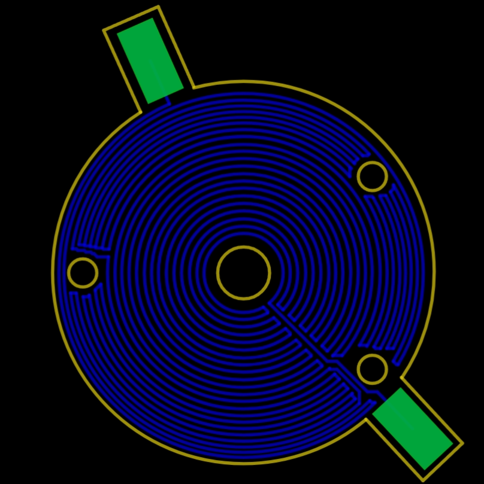

# Heating System - WIP

## Heating Subsystem - PCB <a href="#docs-internal-guid-c7e08341-7fff-16dc-b872-cf2603e73fa6" id="docs-internal-guid-c7e08341-7fff-16dc-b872-cf2603e73fa6"></a>

The heating portion of the 2D crystal stacking machine is used to control the adhesion and deadhesion of crystals with the slide. For this purpose, any heating element should be able to operate between the temperatures of 80C to 180C, as those temperatures represent the upper and lower bounds for adhesion and deadhesion with the polymer on the slide. In the design for the latest heating element, a heating PCB was designed and implemented, though problems have appeared during testing. The PCB uses JLCPCBs aluminum backed PCB option to provide 1W of thermal conductivity while electrically isolating the copper traces on the top layer from the aluminum back layer via a thin dielectric layer. This allows for a thermocouple to be mounted to the aluminum layer via thermal epoxy (in theory; in practice, it has not adhered properly to the aluminum, so work is still to be done in trying to find a proper adhesion method), as thermocouples are required to be electrically isolated from any voltage at the measuring tip. Below, you will find a cross section of the PCB, illustrating the flow of heat and the electrical isolation.

&#x20;.png>)

To generate the heat, I generated a PCB that used concentric copper arcs to create a circular lattice. The copper weight used was 1oz, and the trace length was around 2 meters. This led to a measured resistance of around 20 ohms. The distance between the centers of two parallel copper traces was approximately 0.4mm, and the trace width was 0.25mm. The board dimensions and mounting holes line up with the rotation PCB for the nanopositioner for better compatibility, and the vacuum hole in the center matches the specifications from the vacuum team. Below you can see the initial design that was fabricated.&#x20;

.png>)

In practice, this led to a PCB with the ability to heat up to the maximum operating temperature using 20V at 5A. However, one design consideration that wasn’t addressed in this initial design was that the highest points of resistivity would be at the pads, where the wires joined with the PCB. This led to those points getting significantly hotter than the rest of the PCB, at times, up to 20C more. This led to the wires desoldering themselves when the rest of the board was within normal operating temperatures. The latest PCB design attempts to solve these issues by adding more surface area to the pads so that resistivity can drop and heat can dissipate from the connection over a larger surface area. The following is the new PCB design:&#x20;



## Heating Subsystem - Control Hardware

The current prototype platform I used for controlling the heating element was via an Arduino UNO, though the final control system would use an STM32 for driving the relays and other components. The Arduino outputs a PWM signal with a fixed frequency and a variable duty cycle, with the fixed frequency being determined by the max frequency that the relay could reliably be run at. For this value, 20Hz seemed appropriate, as it was fairly responsive, and worked well with standard 30VDC @ 10A relays. In testing, I obtained the following oscilloscope images when driving a relay at 6.42V and 8.68V at duty cycles of 30 and 90%. .jpeg>)

30% @ 8.68V

.jpeg>)

30% @ 6.42V

.jpeg>)

.jpeg>)

90% @ 6.42V (top is focused on one negedge to posedge, while the bottom is focused on many pulses).

From these images and other subsequent tests swept between 10% and 90% duty cycle, there appears to be a max duty cycle error of 7%, and that errors are independent of voltage, and are instead solely dependent on duty cycle. Thus, to modulate the power seen by the heating element PCB, the system would drive the relay at a constant 28VDC @ 6A, and would use duty cycle variations between 10% and 90% to determine the amount of power seen by the PCB. Since this system is a closed control loop, measurements need to be taken at the heating plate to determine the duty cycle output. For this, an SPI board was used to get readings from a K-type thermocouple, which was tested against an independent thermometer using a hotplate. In testing, the thermometer read a value of 90.7C from the hotplate, while the thermocouple read values between 90C and 92.5C, with stability around 91.5C, which on average represents an error of less than 1C, and at the worst case, represents error of around 1.8C. Below is the full hardware system layout:&#x20;

.png>)

## Heating Subsystem - Control Software

The control system driving the PWM output of the Arduino is a PID controller. As the heating element wasn’t fully working by the time of writing this report, the P, I, and D constants were unable to be tuned within the full system. However, it would have worked as follows. The thermocouple breakout board would send a value as an input into the system. There, the value would have been subtracted from the setpoint temperature, which would have been set by the master board over I2C, creating the error term. This error term would be multiplied by the P constant to form the P term, would have the previous error subtracted from it and multiplied by the D constant over the time difference between timesteps to form the D term, and would be multiplied by the time difference, added to the previous errors, and multiplied by the I constant to form the I term. These terms would then be added together, normalized, and clipped to be values within 10% and 90% duty cycle, which would then drive the PWM control function, which uses hardware timers and interrupts to generate a clean signal. This algorithm generally follows the standard discrete timestep PID control scheme, which is detailed in the image below:&#x20;

.png>)

Where k is the current timestep, y(k) is the duty cycle output, u(k) is the error, Ts is the time between timesteps, and Kp, Ki, and Kd are the PID constants.&#x20;

## Heating Subsystem - Next Steps

The final steps are to fabricate and test the new heating PCB, develop a method to reliably attach wires to it such that they stay connected even at high temperatures (consider silver epoxy) and to connect the entire system together and perform testing, both as an individual unit and as part of the rest of the 2D crystal stacking machine.&#x20;

## Licensing Files

```
This project follows the [Hacker Fab standard license](https://docs.hackerfab.org/home), but with an additional NOTICE for work originating from the Carnegie Mellon University Hacker Fab. The NOTICE.md file in this repositroy is to be carried with this licensing file for all copies of the repositories or its files.

* Hardware: CERN-OHL-W
* Software: MPL v2.0
* Documentation: CC BY-SA 4.0
```

```
Carnegie Mellon University — Open Source Hardware Lab

All files in this repository are provided under the licences listed below.

Any copies or substantial portions of these files \*\*must retain this NOTICE\*\*.

Carnegie Mellon University is to be noted as an author for all files in this repository.


Hardware design files: CERN Open Hardware Licence v2.0 (Strongly/Weakly Reciprocal)

Software \& firmware:   Apache Licence 2.0   (or: Mozilla Public Licence 2.0)

Documentation:         Creative Commons Attribution-ShareAlike 4.0


Trademark \& endorsement:  

“Carnegie Mellon University”, “CMU”, the CMU seal and Tartan logos are

registered trademarks of Carnegie Mellon University.  These marks \*\*may not be

used in derivative works, marketing materials, or product labelling without

separate written permission from CMU\*\*, and no derivative work may imply

CMU’s endorsement or sponsorship.
```
